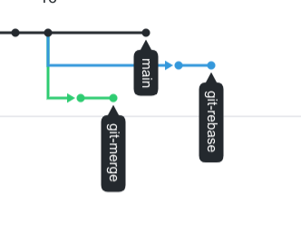
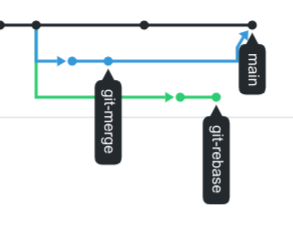
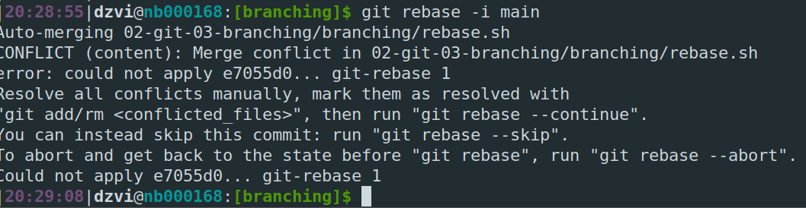
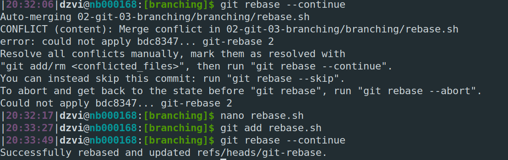

# Homework 02-git-03-branching

* Prepare all files and branches
  

* `git merge git-merge`

* Conflict #1 `git rebase -i main`

* Conflict #2 `git rebase -i main` and happy end

* `git merge git-rebase` and `git push -u origin git-rebase -f` 

