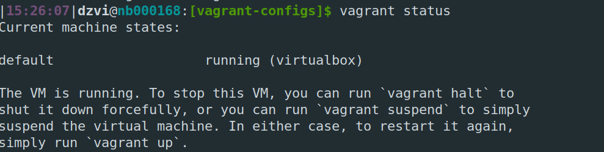

* `vagrant status` 

  

*     # Изменение ресурсов
      Vagrant.configure("2") do |config|
          config.vm.box = "bento/ubuntu-20.04"
          config.vm.provider "virtualbox" do |v|
              v.memory = 2048
              v.cpus = 4
          end
      end

* Размер файла истории можно задать `HISTSIZE` строка 630 \
HISTCONTROL переменная для описнаия правил сохранения истории команд. Директива ignoreboth сокращение директив ignorespace и ignoredups - соответсвенно игнорировать команды для истории 
  которые начинаются с пробела и повторяющиеся команды
* **острока 147** - Ковычки это зарезервированные слова \
  **строка 210** - Ковычки используются для множественного исполнения команд в текущем окружении. 
  Если переменную, например, создать, она будет доступна далее, в отличие от ( ). 
  Сюда же можно отнести использование их для выделения тела функции т.к. по факту это тоже список команд разделеных переводом строки или ; 
  Это в **строке 315** \
  **строка 787** - доступ к элементам массива для корректного раскрытия/расширения пути \
  **строка 810** - расширения. Для всяких строк - например echo 1{2,3,4,5}6 - выведет 126 136 146 156.. Там же про то что с цифрами можно работать {0..10..3} ({start..stop..step}) будет выведено 0 3 6 9. На вскидку в циклах можно использоват - там по разному можно конечно получить последовательность \
  **строка 874** - Ковычки используются для расширнеия парметров. Ковычки являются необязательными, но служат для защиты расширяемой переменной от символов, следующих непосредственно за ней, которые могут быть интерпретированы как часть имени - например ${var}s
* `touch {1..100000}.txt` создать получилось. 300000 нет. Есть ограничение на размер в байтах параметров передаваемых в exec - `getconf ARG_MAX` = 2097152. На вскидку - поигравшись с ulimit и оазмером стека (флаг -s) удалось увеличить кол-во параметров до 160k
* [[ ]] в зависимости от выражени внутри вернет 0 или 1. Речь про exit code. [[ -d /tmp ]] вернет 0 - все хорошо (проверяем echo $?). 1 - если бы дирректория не была найдена \
*     mkdir /tmp/new_path_directory
      cp /bin/bash /tmp/new_path_directory/
      PATH=/tmp/new_path_directory:$PATH
      type -a bash
* Обе каманды выполняют одноразово одну или нексколько команд. Отличия в том что `at` делает это в указанное время, 
  а `batch` когда load average падает ниже 1.5 или указанного значения в команде `atd` 
