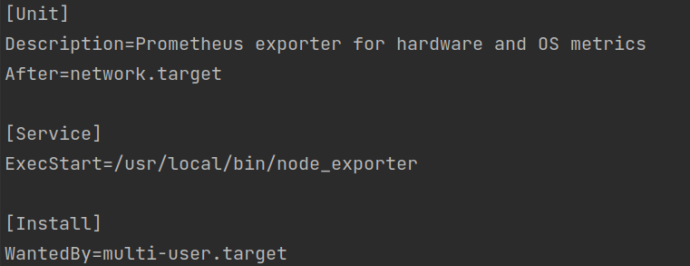
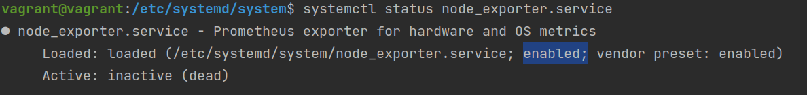
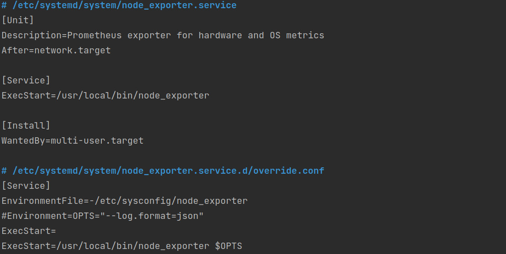
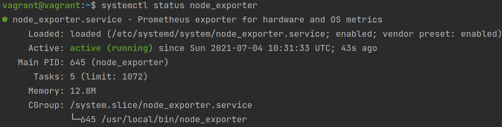
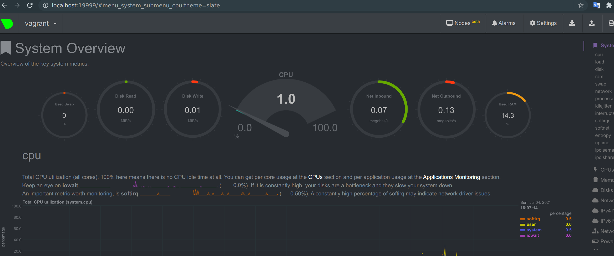
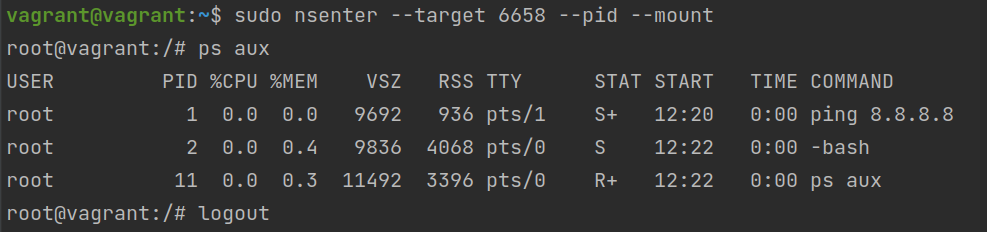
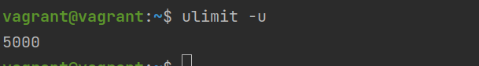

# Домашнее задание к занятию "3.4. Операционные системы, лекция 2"

1. #### На лекции мы познакомились с [node_exporter](https://github.com/prometheus/node_exporter/releases). В демонстрации его исполняемый файл запускался в background. Этого достаточно для демо, но не для настоящей production-системы, где процессы должны находиться под внешним управлением. Используя знания из лекции по systemd, создайте самостоятельно простой [unit-файл](https://www.freedesktop.org/software/systemd/man/systemd.service.html) для node_exporter:

    * #### поместите его в автозагрузку,
      Создадим файл node_exporter.service в /etc/systemd/system  
      `systemctl daemon-reload`  
      `systemctl cat node_exporter`  
        
      `systemctl enable node_exporter.service` - добавим в автозагрузку  
        
    * #### предусмотрите возможность добавления опций к запускаемому процессу через внешний файл (посмотрите, например, на `systemctl cat cron`),
      `sudo nano /etc/sysconfig/node_exporter` -> Создадим Environment файл для в котором зададим переменную OPTS. 
      Либо ее можно задать через опцию Environment как показано ниже на картинке (закомментрована, но проверено - работает). Пишут что лучше работать с Environment опцией для задания переменных окружения нежели с EnvironmentFile  
      `cat /etc/sysconfig/node_exporter` -> OPTS=--log.format=json  
      `sudo systemctl edit node_exporter` - переопределим некотрые настройки сервиса  
        
      `sudo systemctl daemon-reload`  
      `sudo systemctl restart node_exporter`
    * #### удостоверьтесь, что с помощью systemctl процесс корректно стартует, завершается, а после перезагрузки автоматически поднимается.
      `sudo systemctl start node_exporter`  
      `systemctl status node_exporter`  
      `sudo systemctl stop node_exporter`  
      `systemctl status node_exporter`  
      `vagrant reload` -> `vagrant ssh`  
      `systemctl status node_exporter`  
        
      Все отработало корректно
1. #### Ознакомьтесь с опциями node_exporter и выводом `/metrics` по-умолчанию. Приведите несколько опций, которые вы бы выбрали для базового мониторинга хоста по CPU, памяти, диску и сети.
   First Header  | Second Header
   ------------- | -------------
   cpu  | Exposes CPU statistics
   cpufreq  | Exposes CPU frequency statistics
   diskstats | Exposes disk I/O statistics
   filefd | 	Exposes file descriptor statistics from /proc/sys/fs/file-nr
   filesystem | Exposes filesystem statistics, such as disk space used.	
   loadavg | Exposes load average
   meminfo | Exposes memory statistics
   netdev | Exposes network interface statistics such as bytes transferred
   netstat | ses network statistics from /proc/net/netstat. This is the same information as netstat -s
   смотрел полный [список](https://github.com/prometheus/node_exporter) дефолтных параметров 
1. #### Установите в свою виртуальную машину [Netdata](https://github.com/netdata/netdata). Воспользуйтесь [готовыми пакетами](https://packagecloud.io/netdata/netdata/install) для установки (`sudo apt install -y netdata`). После успешной установки:
    * в конфигурационном файле `/etc/netdata/netdata.conf` в секции [web] замените значение с localhost на `bind to = 0.0.0.0`,
    * добавьте в Vagrantfile проброс порта Netdata на свой локальный компьютер и сделайте `vagrant reload`:

    ```bash
    config.vm.network "forwarded_port", guest: 19999, host: 19999
    ```

    #### После успешной перезагрузки в браузере *на своем ПК* (не в виртуальной машине) вы должны суметь зайти на `localhost:19999`. Ознакомьтесь с метриками, которые по умолчанию собираются Netdata и с комментариями, которые даны к этим метрикам.
   
1. #### Можно ли по выводу `dmesg` понять, осознает ли ОС, что загружена не на настоящем оборудовании, а на системе виртуализации?
   Можно `dmesg -THu`  
   [  +0.000000] Hypervisor detected: KVM  
   `dmesg -THu | grep virtual`  
   [    0.070613] Booting paravirtualized kernel on KVM  
   [    2.603496] systemd[1]: Detected virtualization oracle.  
1. #### Как настроен sysctl `fs.nr_open` на системе по-умолчанию? Узнайте, что означает этот параметр. Какой другой существующий лимит не позволит достичь такого числа (`ulimit --help`)?
   `sysctl fs.nr_open` -> fs.nr_open = 1048576 - максимально кол-во файловых дескрипторов, которые могут быть открыты для 
   ресурса. Это hard ограничение. Есть так же soft ограничение - `ulimit -n` или `prlimit -n`. Можно изменить - например ulimit -n 1024
   hard лимит действует как потолок для soft лимита т.е. непривилегированный процесс может установить только свой soft лимит до значения в диапазоне от 0 до hard лимита. 
1. #### Запустите любой долгоживущий процесс (не `ls`, который отработает мгновенно, а, например, `sleep 1h`) в отдельном неймспейсе процессов; покажите, что ваш процесс работает под PID 1 через `nsenter`. Для простоты работайте в данном задании под root (`sudo -i`). Под обычным пользователем требуются дополнительные опции (`--map-root-user`) и т.д.
   `sudo unshare -f --pid --mount-proc ping 8.8.8.8`  
   В другом терминале `ps aux | grep ping` или `pstree -p | grep ping` -> -sshd(4007)---sshd(4046)---bash(4047)---sudo(6656)---unshare(6657)---ping(6658)  
   `sudo nsenter --target 6658 --pid --mount` и `ps aux`  
   
1. #### Найдите информацию о том, что такое `:(){ :|:& };:`. Запустите эту команду в своей виртуальной машине Vagrant с Ubuntu 20.04 (**это важно, поведение в других ОС не проверялось**). Некоторое время все будет "плохо", после чего (минуты) – ОС должна стабилизироваться. Вызов `dmesg` расскажет, какой механизм помог автоматической стабилизации. Как настроен этот механизм по-умолчанию, и как изменить число процессов, которое можно создать в сессии?
   По ходу нашел интересный [сайтик](https://explainshell.com/explain?cmd=%3A%28%29%7B+%3A%7C%3A%26+%7D%3B%3A#)  
   forkbomb - рекурсивно запускает саму себя несколько раз в фоне. Используется для определения и проверки лимитов  
   `:() { .. }` - определяет функцию без параметров  
   `:|:&` - вызовет саму себя и отправит вывод на вход другого вызова :, отправив его в фон  
   `:` - последнее двоеточее собственно и вызовет в первый раз функцию  
   `dmesg` -> [84403.852382] cgroup: fork rejected by pids controller in /user.slice/user-1000.slice/session-3.scope  
   `pids controller` - The process number controller is used to allow a cgroup hierarchy to stop any new tasks from being fork()'d or clone()'d after a certain limit is reached.  
   По умолчанию можем увидеть все лимиты для пользователя текущего `ulimit -a`. `ulimit -u` - макс колво процессов
   Увеличить можно через файл `/etc/security/limits.conf` добавив туда запись типа `* soft nproc 5000` и `* hard nproc 5000`. * - любой пользователь  
   