# Домашнее задание к занятию "3.5. Файловые системы"

1. #### Узнайте о [sparse](https://ru.wikipedia.org/wiki/%D0%A0%D0%B0%D0%B7%D1%80%D0%B5%D0%B6%D1%91%D0%BD%D0%BD%D1%8B%D0%B9_%D1%84%D0%B0%D0%B9%D0%BB) (разряженных) файлах.  
   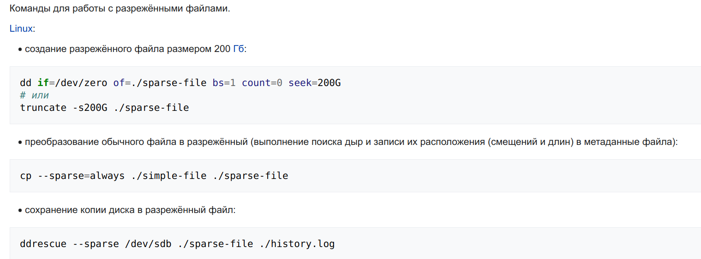
1. #### Могут ли файлы, являющиеся жесткой ссылкой на один объект, иметь разные права доступа и владельца? Почему?
   Не могут.  Т.к. жесткая ссылка это всего лишь еще одно имя одного и того же файла, а вся информация по правам доступа хранится в самом файле    
   `man 2 stat`  
   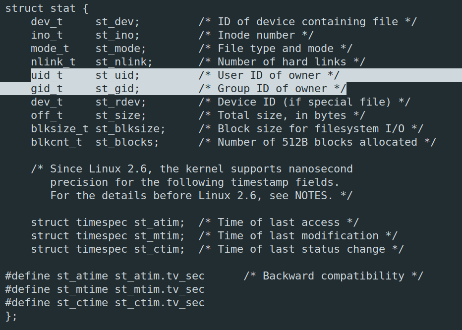  
1. #### Сделайте `vagrant destroy` на имеющийся инстанс Ubuntu. Замените содержимое Vagrantfile следующим:

    ```bash
    Vagrant.configure("2") do |config|
      config.vm.box = "bento/ubuntu-20.04"
      config.vm.provider :virtualbox do |vb|
        lvm_experiments_disk0_path = "/tmp/lvm_experiments_disk0.vmdk"
        lvm_experiments_disk1_path = "/tmp/lvm_experiments_disk1.vmdk"
        vb.customize ['createmedium', '--filename', lvm_experiments_disk0_path, '--size', 2560]
        vb.customize ['createmedium', '--filename', lvm_experiments_disk1_path, '--size', 2560]
        vb.customize ['storageattach', :id, '--storagectl', 'SATA Controller', '--port', 1, '--device', 0, '--type', 'hdd', '--medium', lvm_experiments_disk0_path]
        vb.customize ['storageattach', :id, '--storagectl', 'SATA Controller', '--port', 2, '--device', 0, '--type', 'hdd', '--medium', lvm_experiments_disk1_path]
      end
    end
    ```
   
   #### Данная конфигурация создаст новую виртуальную машину с двумя дополнительными неразмеченными дисками по 2.5 Гб.
   Done  
   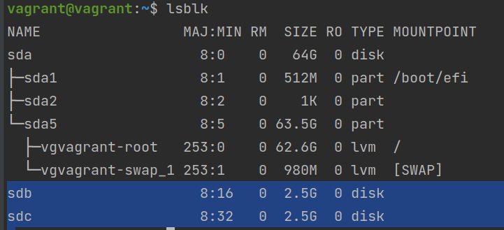  
1. #### Используя `fdisk`, разбейте первый диск на 2 раздела: 2 Гб, оставшееся пространство.
   `sudo fdisk /dev/sdb`  
   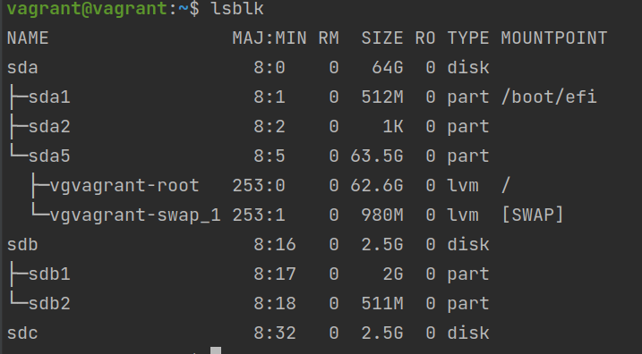  
1. #### Используя `sfdisk`, перенесите данную таблицу разделов на второй диск.  
   `sudo sfdisk -d /dev/sdb > dump_part_sdb`  
   `sudo sfdisk /dev/sdc < dump_part_sdb`  
   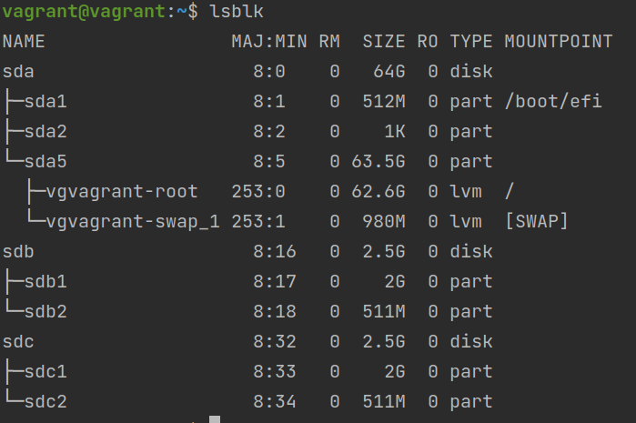
1. #### Соберите `mdadm` RAID1 на паре разделов 2 Гб.  
   Set partition type 'Linux raid autodetect' for all partitions    
   `sudo mdadm --create --verbose /dev/md1 --level=1 --raid-devices=2 /dev/sdb1 /dev/sdc1`  
1. #### Соберите `mdadm` RAID0 на второй паре маленьких разделов.  
   `sudo mdadm --create --verbose /dev/md0 --level=0 --raid-devices=2 /dev/sdb2 /dev/sdc2`  
   `lsblk -o NAME,SIZE,FSTYPE,TYPE`  
   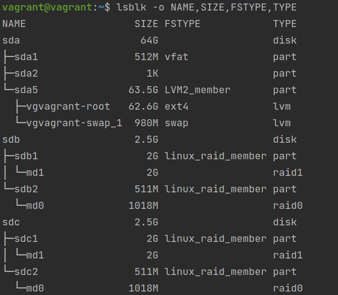
1. #### Создайте 2 независимых PV на получившихся md-устройствах.  
   `sudo pvcreate /dev/md0` и `sudo pvcreate /dev/md1`  
   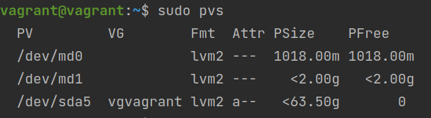
1. #### Создайте общую volume-group на этих двух PV.
   `sudo vgcreate vgmd /dev/md0 /dev/md1`
   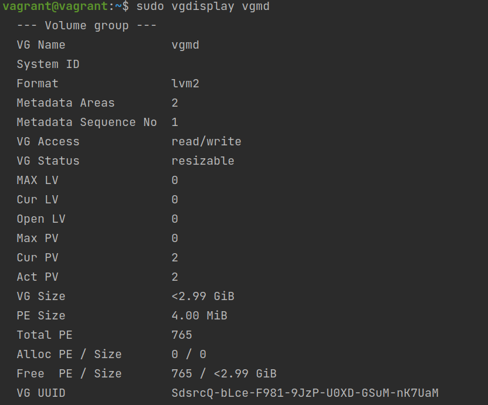
1. #### Создайте LV размером 100 Мб, указав его расположение на PV с RAID0.  
   `sudo lvcreate --size 100M -n lv_100m vgmd /dev/md0`  
   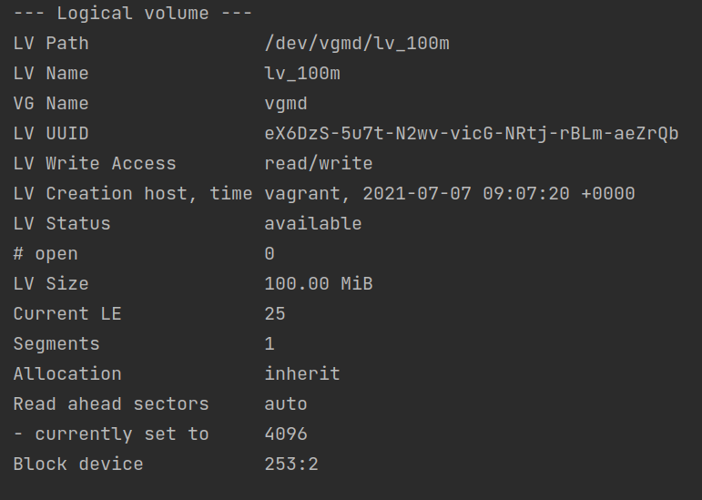
1. #### Создайте `mkfs.ext4` ФС на получившемся LV.
   `sudo mkfs.ext4 /dev/vgmd/lv_100m`
1. #### Смонтируйте этот раздел в любую директорию, например, `/tmp/new`.  
   `sudo mount /dev/vgmd/lv_100m /mnt/lv_100m`
1. #### Поместите туда тестовый файл, например `wget https://mirror.yandex.ru/ubuntu/ls-lR.gz -O /tmp/new/test.gz`.
   `sudo wget https://mirror.yandex.ru/ubuntu/ls-lR.gz -O /mnt/lv_100m/test.gz`
1. #### Прикрепите вывод `lsblk`.  
   `lsblk -o NAME,SIZE,FSTYPE,TYPE`  
   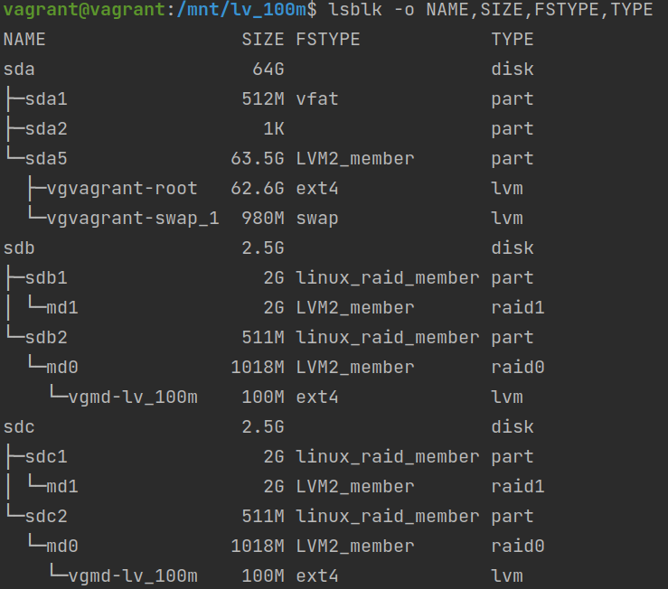
1. #### Протестируйте целостность файла:

    ```bash
    root@vagrant:~# gzip -t /tmp/new/test.gz
    root@vagrant:~# echo $?
    0
    ```
   `gzip -t test.gz` и `echo $?`  
   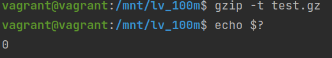
1. #### Используя pvmove, переместите содержимое PV с RAID0 на RAID1.
   `sudo pvmove /dev/md0 /dev/md1`
1. #### Сделайте `--fail` на устройство в вашем RAID1 md.
   `sudo mdadm /dev/md1 --fail /dev/sdb1` -> mdadm: set /dev/sdb1 faulty in /dev/md1  
1. #### Подтвердите выводом `dmesg`, что RAID1 работает в деградированном состоянии.
   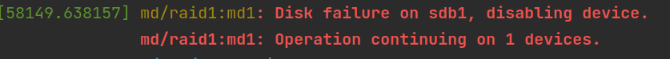
1. Протестируйте целостность файла, несмотря на "сбойный" диск он должен продолжать быть доступен:

    ```bash
    root@vagrant:~# gzip -t /tmp/new/test.gz
    root@vagrant:~# echo $?
    0
    ```
   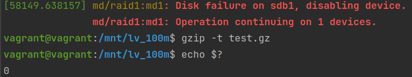
1. Погасите тестовый хост, `vagrant destroy`.