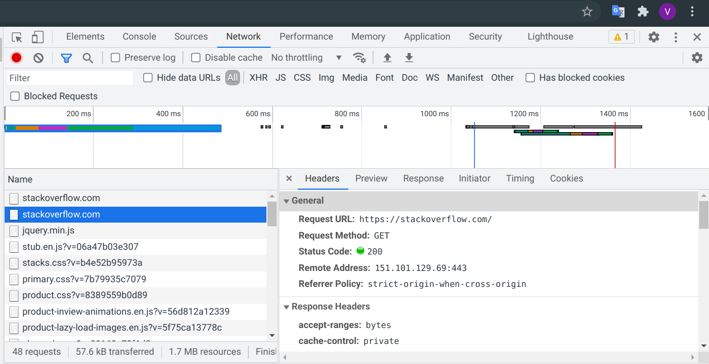
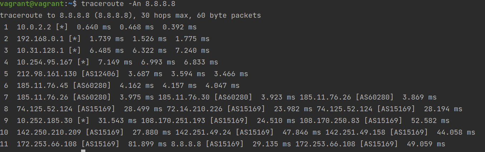
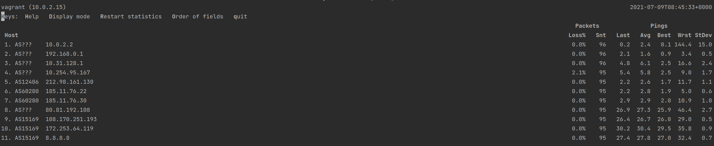
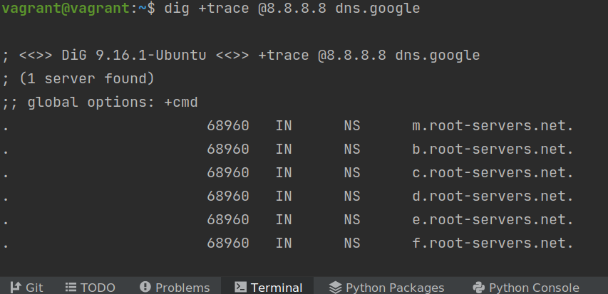
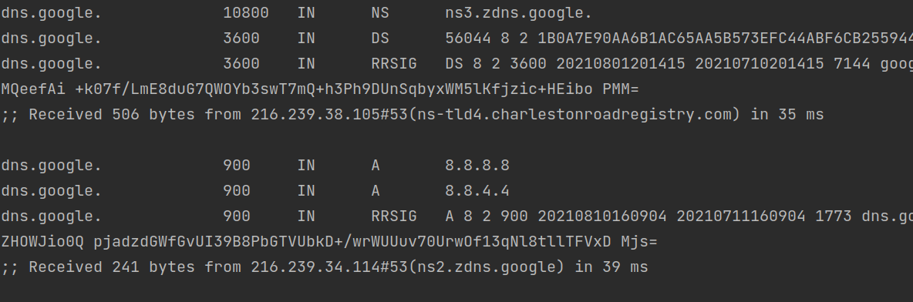
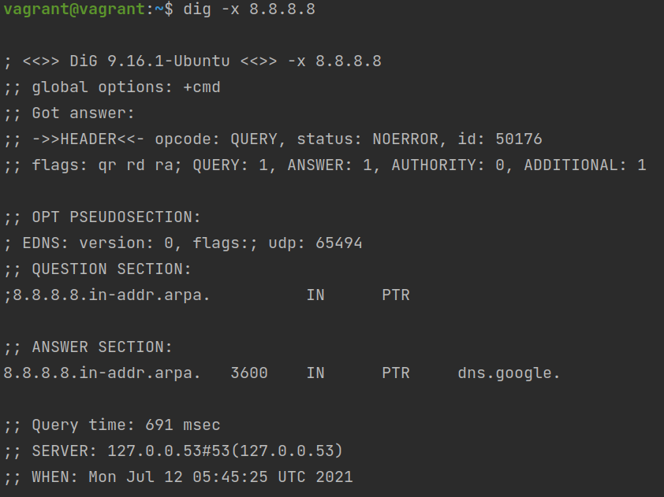

# Домашнее задание к занятию "3.6. Компьютерные сети, лекция 1"

1. #### Работа c HTTP через телнет.
- #### Подключитесь утилитой телнет к сайту stackoverflow.com
`telnet stackoverflow.com 80`
- #### отправьте HTTP запрос
```bash
GET /questions HTTP/1.0
HOST: stackoverflow.com
[press enter]
[press enter]
```
- #### В ответе укажите полученный HTTP код, что он означает?  
    301 - Этот код означает что url  stackoverflow.com:80/questions был перенесен в новое месторасположение и текущие ссылки должны быть обновлены.
   Адрес нового месторасположения ресурса указывается в хидере Location: https://stackoverflow.com/questions  
2. #### Повторите задание 1 в браузере, используя консоль разработчика F12.
- #### откройте вкладку `Network`
- #### отправьте запрос http://stackoverflow.com
- #### найдите первый ответ HTTP сервера, откройте вкладку `Headers`
- #### укажите в ответе полученный HTTP код.  
  `Status Code: 307 Internal Redirect`
- #### проверьте время загрузки страницы, какой запрос обрабатывался дольше всего?
  `https://stackoverflow.com/` - 475ms
- #### приложите скриншот консоли браузера в ответ.
    
3. #### Какой IP адрес у вас в интернете?
   `https://whoer.net/` -> 46.53.249.121  
4. #### Какому провайдеру принадлежит ваш IP адрес? Какой автономной системе AS? Воспользуйтесь утилитой `whois`
   `whois -h whois.ripe.net 46.53.249.121`
    >address:        A1 - Провайдер  
    address:        Internatsionalnaya st., 36-2  
    address:        Minsk  
    address:        Republic of Belarus  
    abuse-mailbox:  abuse@a1.by  
    phone:          +375 29 6000710  
   
   Автономная система - origin: AS42772
5. #### Через какие сети проходит пакет, отправленный с вашего компьютера на адрес 8.8.8.8? Через какие AS? Воспользуйтесь утилитой `traceroute`
      
   Сети - 10, 192, 212, 185, 178, 108, 142, 72  
   AS (флаг -S ) - AS12406, AS60280, AS15169  
6. #### Повторите задание 5 в утилите `mtr`. На каком участке наибольшая задержка - delay?
    `mtr -zn 8.8.8.8`  
     
   Наибольшая задержка на участке `10. AS15169  172.253.64.119`  
7. #### Какие DNS сервера отвечают за доменное имя dns.google? Какие A записи? воспользуйтесь утилитой `dig`
    `dig +trace @8.8.8.8 dns.google`  
     
   Сначала запросы идут на корневые серера с типами записи NS
   `*.root-servers.net` -> `ns-tld*.charlestonroadregistry.com` -> `ns*.zdns.google`  
   В итоге получаем сервера с типо dns записи A:  
   dns.google.             900     IN      A       8.8.8.8  
   dns.google.             900     IN      A       8.8.4.4  
   
8. #### Проверьте PTR записи для IP адресов из задания 7. Какое доменное имя привязано к IP? воспользуйтесь утилитой `dig`
    `dig -x 8.8.8.8` и `dig -x 8.8.4.4`
     
   `8.8.8.8.in-addr.arpa.   3600    IN      PTR     dns.google.`  
   `4.4.8.8.in-addr.arpa.   3600    IN      PTR     dns.google.`  
В качестве ответов на вопросы можно приложите лог выполнения команд в консоли или скриншот полученных результатов.