# Домашнее задание к занятию "3.7. Компьютерные сети, лекция 2"
   Обновим Vagrantfile на файл из задания для построения multi-VM environment из 3 виртуалок. Лучше добавить еще и ограничения на cpu и ram
1. #### Проверьте список доступных сетевых интерфейсов на вашем компьютере. Какие команды есть для этого в Linux и в Windows?
    `ip -c -br link` для Linux. `netsh interface show interface` для Windows  
   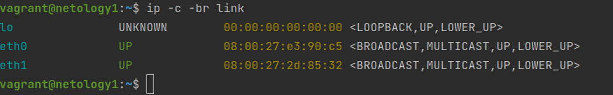  
2. #### Какой протокол используется для распознавания соседа по сетевому интерфейсу? Какой пакет и команды есть в Linux для этого?
   Link Layer Discovery Protocol [(LLDP)](https://ru.wikipedia.org/wiki/LLDP) - протокол канального уровня, позволяющий сетевому оборудованию оповещать оборудование, 
   работающее в локальной сети, о своём существовании и передавать ему свои характеристики, а также получать от него аналогичные сведения. 
   Для работы в Linux необходимо установить пакет `lldpd`. Устанавливаем пакеты, включаем автозагрузку и стартуем сервис на каждой виртуалке  
   `sudo apt install lldpd`  
   `sudo systemctl enabled lldpd && systemctl start lldpd`
   `lldpctl` - поакажет информацию о соседних устройствах  
   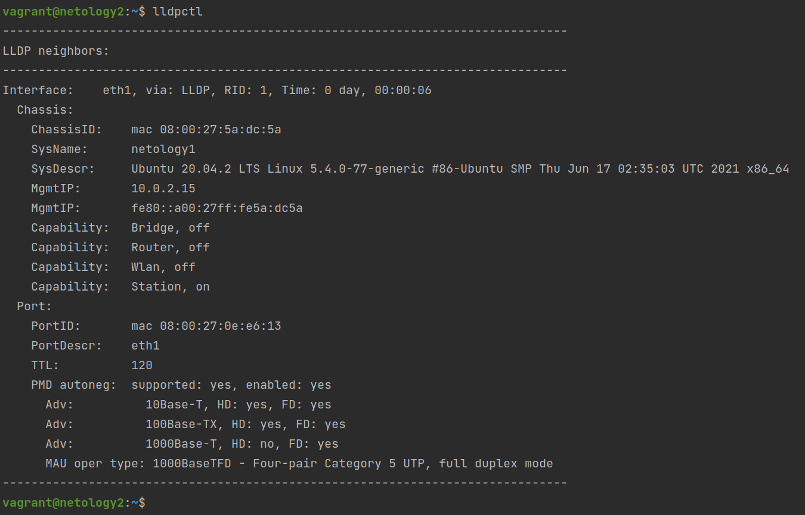  
   Так же далем для netology3 и в ответе увидим уже информацию о 2 виртуалках
3. #### Какая технология используется для разделения L2 коммутатора на несколько виртуальных сетей? Какой пакет и команды есть в Linux для этого? Приведите пример конфига.
   [VLAN](https://ru.wikipedia.org/wiki/VLAN) - виртуальная локальная компьютерная сеть. Представляет собой группу хостов с общим набором требований, 
   которые взаимодействуют так, как если бы они были подключены к широковещательному домену независимо от их физического местонахождения  
   `apt install vlan`  
   `vconfig add INT VID`  
   INT - сетевой интрефейс,  
   VID - номер виртуальной сети  
   `sudo cat /proc/net/vlan/eth1.2` - посмотреть информацию  
   Давайте проверим как это работает и настроим vlan c id 2 для контейнеров netology1 и netology2 и vlan c id 3 для netology3.
   По идее, после того как мы все сделаем, можно будет обратиться к установленному nginx между виртуалками 1 и 2. И не иметь доступ к виртуалке 3.  
   `apt install vlan`  
   `vagrant@netology3:~$ sudo vconfig add eth1 3`  
   Поднимем интерфейс и назначим ему IP  
   `ip link set dev eth1.3 up`  
   `sudo ip addr add 192.168.0.90/24 dev eth1.3`  
   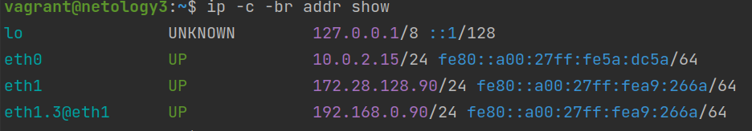  
   Сделаем тоже самое для виртуалок 1 и 2 только добавим их во vlan c id 2 и назначим им ip 192.168.0.10/24 и 192.168.0.60/24   
   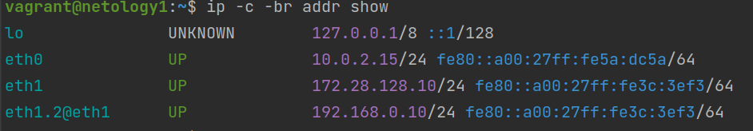  
   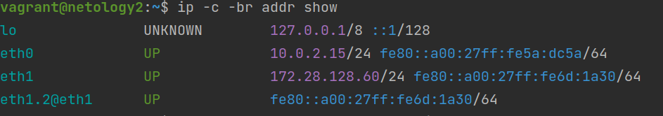  
   Попробуем достучаться. С 1 виртуалки можем достучаться до 2 (и наоборот) и не имеем доступ к 3. Тоже будет и с 2
   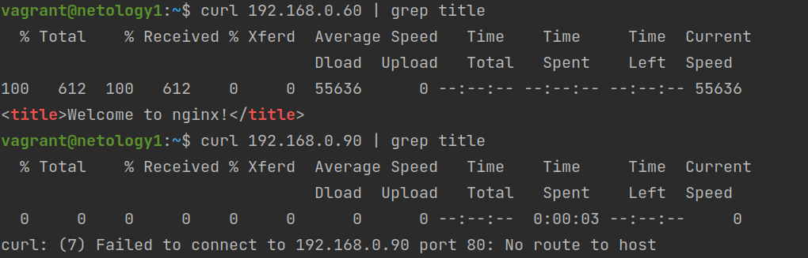  
   А вот с 3 достучаться не можем ни к 1 ни к 2 т.к. она в другой vlan  
   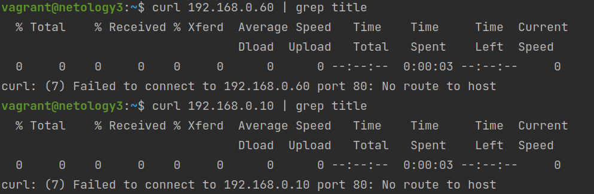  
   ========================================================  
   Попробуем добавить конфиг для виртуалок 2 и 3 что в разных vlan и перезагрузить их.  
   Конфиг `sudo nano /etc/network/interfaces`  
   Добавим конфиг  
     
   `vagrant halt`  
   `vagrant up`  
   После перезагрузки на виртуалке где не было конфига интерфейс не поднялся  
   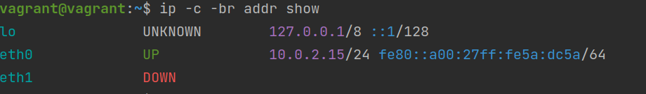  
   И там где добавили конфиг все работает (только для eth1 не прописан IP т.к. он иницилизировался в файле VagrantConfig)  
   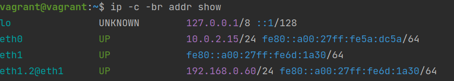  
   
4. #### Какие типы агрегации интерфейсов есть в Linux? Какие опции есть для балансировки нагрузки? Приведите пример конфига.
   * LACP (Link Aggregation Control Protocol) стандартный протокол
   * PAgP (Port Aggregation Protocol) проприетарный протокол Cisco
   * Статическое агрегирование без использования протоколов  
   Из основных опций для балансировки:  
     * active-backup или 1: Только один slave активен в единицу времени. Второй slave активируется после аварии с первым slave. Данный режим обеспечивает только отказоустойчивость.
     * balance-xor или 2: Применяется хеш политика в виде MAC-источника XOR MAC-получателя. Данный режим обеспечивает отказоустойчивость и балансировку нагрузки.
     * broadcast или 3: Передача идёт через все slave. Данный режим обеспечивает только отказоустойчивость.
     * 802.3ad или 4: Должен применятся только если коммутатор поддерживает IEEE 802.3ad Dynamic link aggregation.
     * balance-tlb или 5: Не требуется поддержка со стороны коммутатора. Исходящий трафик распределяется в зависимости от текущей нагрузки каждого slave. Входящий трафик поступает на текущий slave и если он отказывает, то другой slave берёт работу на себя.
     * balance-alb или 6: alb - Adaptive load balancing. Работает как balance-tlb + балансировка нагрузки rlb для IPv4.  
   Пример конфига для /etc/network/interfaces  
       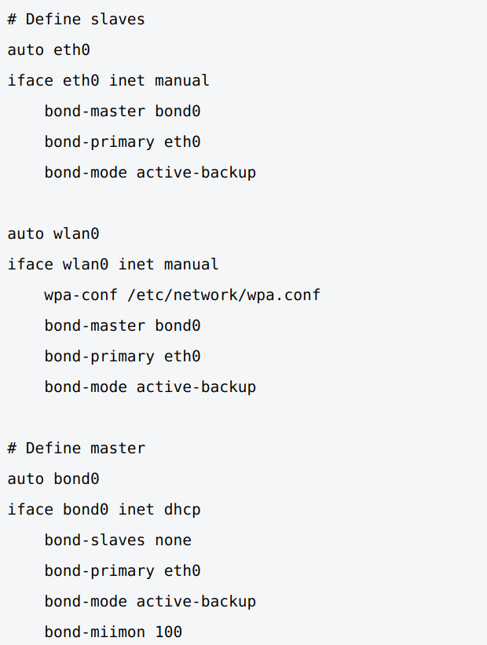
5. #### Сколько IP адресов в сети с маской /29 ? Сколько /29 подсетей можно получить из сети с маской /24. Приведите несколько примеров /29 подсетей внутри сети 10.10.10.0/24.  
   `sudo apt install ipcalc`  
   `ipcalc -b 10.10.10.0/24` => /24 - 254 адресов + 2 резерв, `ipcalc -b 10.10.10.0/29` => /29 - 6 адресов + 2 резерв. Соответсвенно из /24 сети можно получить (256:8) 32 /29 подсети  
   Например 10.10.10.0/29, 10.10.10.8/29, 10.10.10.16/29, 10.10.10.24/29 и т.д.
6. #### Задача: вас попросили организовать стык между 2-мя организациями. Диапазоны 10.0.0.0/8, 172.16.0.0/12, 192.168.0.0/16 уже заняты. Из какой подсети допустимо взять частные IP адреса? Маску выберите из расчета максимум 40-50 хостов внутри подсети.
   Для 40-50 машин достаточно 26 маски. Возьмем сеть 100.64.0.0/26
7. #### Как проверить ARP таблицу в Linux, Windows? Как очистить ARP кеш полностью? Как из ARP таблицы удалить только один нужный IP?
   Windows: `arp -a` - посмотреть, `arp -d 192.168.100.25` - удалить запись по IP 192.168.100.25, `arp -d *` - удалить все записи 
   (посмотрел в [доке](https://docs.microsoft.com/en-us/windows-server/administration/windows-commands/arp). проверить не на чем)  
   Linux: `ip neigh` - посмотреть, `ip neigh del {IPAddress} dev {DEVICE}` - удалить запись по IP , `sudo ip neigh flush all` - удалить все  
   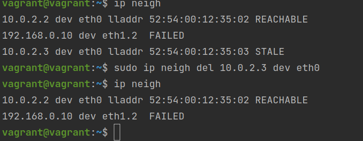
 ---
## Задание для самостоятельной отработки (необязательно к выполнению)

 8*. Установите эмулятор EVE-ng.
 
 Инструкция по установке - https://github.com/svmyasnikov/eve-ng

 Выполните задания на lldp, vlan, bonding в эмуляторе EVE-ng. 