# Домашнее задание к занятию "3.8. Компьютерные сети, лекция 3"

1. #### Подключитесь к публичному маршрутизатору в интернет. Найдите маршрут к вашему публичному IP
```
telnet route-views.routeviews.org
Username: rviews
show ip route x.x.x.x/32
show bgp x.x.x.x/32
```
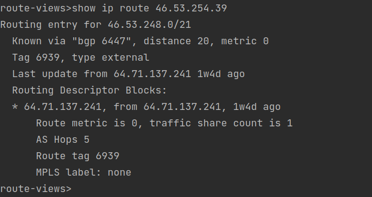  

Наилучший марщрут  

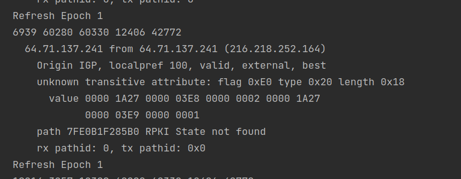  

2. #### Создайте dummy0 интерфейс в Ubuntu. Добавьте несколько статических маршрутов. Проверьте таблицу маршрутизации.  
   Проверяем включен ли модуль ядра - `lsmod | grep dummy`  
   Если нет - `sudo modprobe dummy`  
   Добавим интерфейс - `sudo ip link add dummy0 type dummy`  
   Добавим ip из свободного пула - `sudo ip a add 192.168.1.90/24 dev dummy0`. Создастся запись в таблице маршрутизации о 
   том что данные из любого узла подсети 192.168.1.0/24 направлять на интерфейс dummy0 с ip 192.168.1.90
   Поднимем интерфейс - `sudo ip l set dev dummy0 up` и пинганем его  
   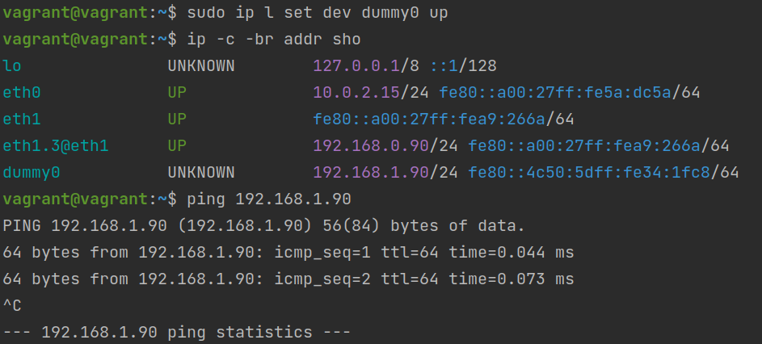  
   Проверим что интерфейс слушается - отправим неткатом `nc 192.168.1.90 9000` сообщение HelloWorld и получим его nc c опцией -l  
   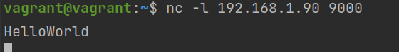  
   Добавим в таблицу маршрутизации несколько статических маршрутов:  
      1. Перенаправление с конкретного адреса на другой интерфейс  (активируем возможность такую `sudo sysctl net.ipv4.ip_forward=1`)
         `sudo ip route add 192.168.1.92 dev eth1.3`  
         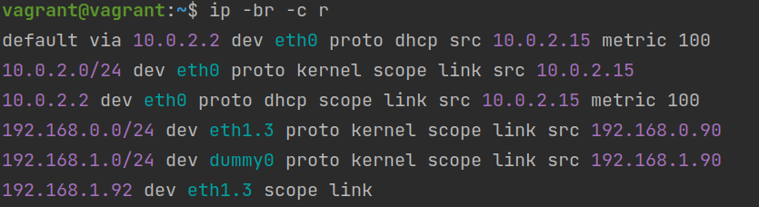  
         Проверим идут ли пакеты на указанный интерфейс `nc -v 192.168.1.92 9000` и `sudo tcpdump -v -i eth1.3`  
         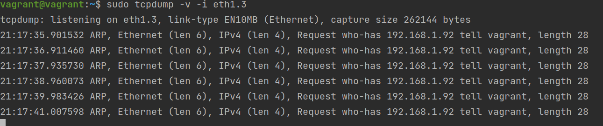  
      1. Перенапрвление c меньшей подсети  
        `sudo ip r add 192.168.1.0/30 dev eth1.3`  
        Попытаемся подключится и увидим такую же картину как и выше  
        `nc -v 192.168.1.2 9000`  
         
   Итоговая таблица маршрутизации `ip -br -c r`  
   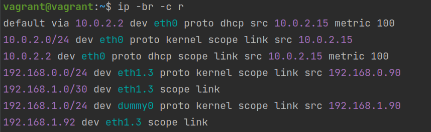  
3. #### Проверьте открытые TCP порты в Ubuntu, какие протоколы и приложения используют эти порты? Приведите несколько примеров.
    `ss -tap` - установленныйе соединения и прослушивающиеся порты по протоколу TCP, а так же процессы которые слушают порты.
   Можно увидеть 3 установленных ssh сессии (из каждой вкладки консоли) и прослушивание порта 9000 командо `nc -l` в одной из них  
   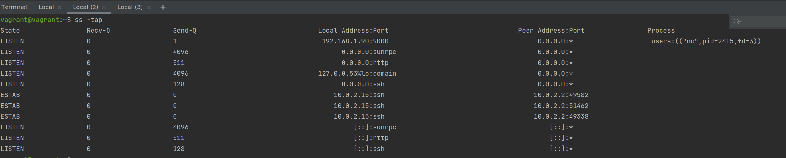  
4. #### Проверьте используемые UDP сокеты в Ubuntu, какие протоколы и приложения используют эти порты?
   Для UDP команда `ss -uap`  
   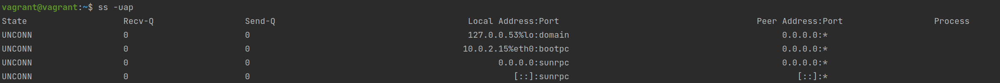  
5. #### Используя diagrams.net, создайте L3 диаграмму вашей домашней сети или любой другой сети, с которой вы работали. 
    Попытался нарисовать домашнюю сеть  
    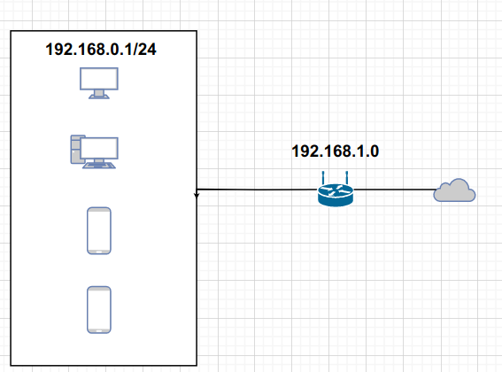
 ---
## Задание для самостоятельной отработки (необязательно к выполнению)

6. #### Установите Nginx, настройте в режиме балансировщика TCP или UDP.
    Поднимем 4 виртуалки - 1 клиент, 2 - балансировщик, 3,4 - конечные сервера  
    Установим сразу на всех 4 виртуалках nginx и создадим уникальные статические файлы страницы которые наши сервра будут отдавать, 
    чтобы видеть как работает балансировщик.  
    Проапдейтим [Vagrantfile](Vagrantfile)
    Настроим балансировщик - виртуалка 2. Добавим конфиг `/etc/nginx/conf.d/proxyTCP.conf`. Укажем адреса наших серверов 3 и 4. Перезагрузим конфиг `nginx -s reload`
   ```
        upstream backend1 {
            server 172.28.128.90:8080;
            server 172.28.128.120:8080;
        }
        server {
            listen 8080;
            location / {
                proxy_pass http://backend1;
            }
        }

    ```  
   Настроим наши условные сервра чтобы они отдавали кастомные ответы из файлов типа `Hello from netologyN` 
   ```
   server {
        listen 8080;
        location / {
                root /data/www;
                index  index.html index.htm;
        }
   }
   ```
   Пойдем на 1 виртуалку и запустим клиент.  
   `while sleep 1; do curl 172.28.128.60:8080;done`  
   Будем делать запросы на балансировщик 2, который по очереди будет пробрасывать запросы то на 3, то на 4 сервер  
    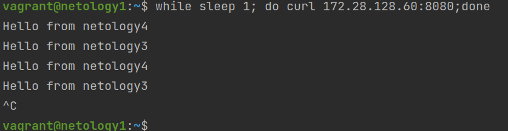  
7. Установите bird2, настройте динамический протокол маршрутизации RIP.  
    *-------------------------------------
8. Установите Netbox, создайте несколько IP префиксов, используя curl проверьте работу API.  
    *-------------------------------------