# Домашнее задание к занятию "3.9. Элементы безопасности информационных систем"

1. #### Установите Bitwarden плагин для браузера. Зарегестрируйтесь и сохраните несколько паролей.
    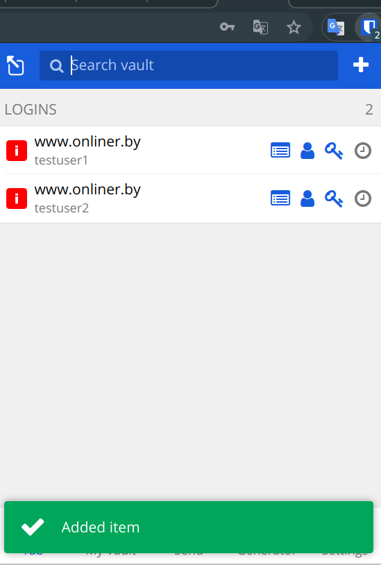
2. #### Установите Google authenticator на мобильный телефон. Настройте вход в Bitwarden акаунт через Google authenticator OTP.    
   Т.к. у меня уже есть authy и я его использую, то вместо  Google authenticator я выбрал ее  
   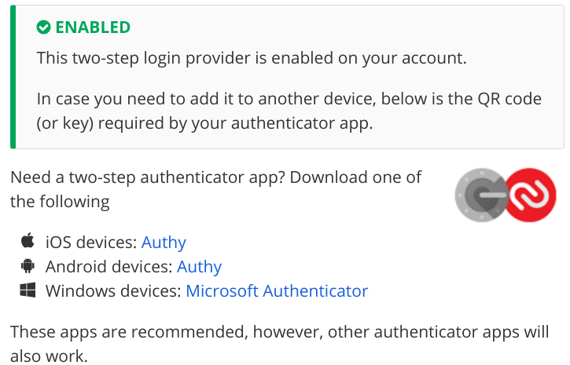
3. #### Установите apache2, сгенерируйте самоподписанный сертификат, настройте тестовый сайт для работы по HTTPS.
   `sudo apt install apache2`   
   `sudo a2enmod ssl`  
   `sudo systemctl restart apache`  
   `sudo mkdir /var/www/example`  
   `sudo nano /var/www/example/index.html` ->  "Hello Netology!"  
   `sudo nano /etc/apache2/ports.conf` -> Добавим Listen 19999 - слушать порт для нашего нового сайта - пробросили его в нашу виртуалку чтобы открыть в браузере сайт  
   `sudo nano /etc/apache2/sites-available`->  
   ```
      <VirtualHost *:19999>
         DocumentRoot /var/www/example  
      </VirtualHost> 
   ```  
   `sudo a2ensite example.conf`  
   `sudo systemctl reload apache2`  
   `curl localhost:19999`  
   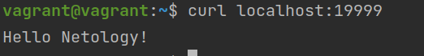
   Сгенерируем сертификат 
   ```
   sudo openssl req -x509 \
     -days 365 \
     -sha256 \
     -newkey rsa:2048 \
     -nodes \
     -keyout example.key \
     -out example-cert.pem
   ```   
   Сертификат выпишем на домен localhost.example.com:19999  
   `sudo cp example-cert.pem /etc/ssl/certs`  
   `sudo cp example.key /etc/ssl/private`  
   Проапдейтим наш файл конфигурации добавив туда настройки ssl. Порт оставим прежним  
   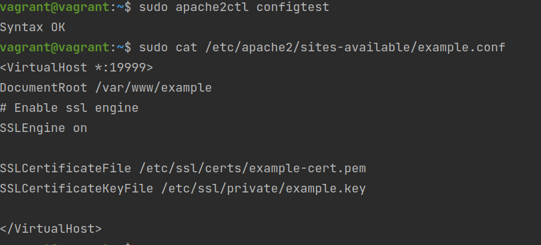  
   Добавим в /etc/hosts на PC временную запись 127.0.0.1 localhost.example.com 
   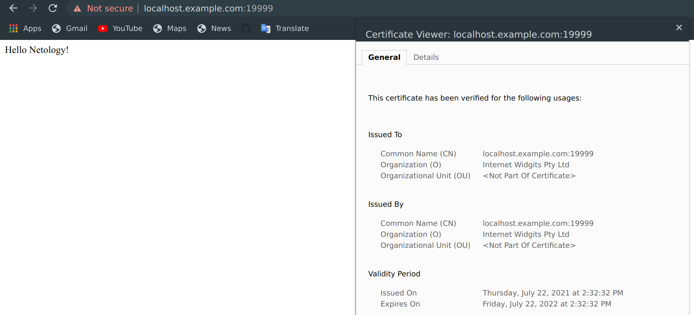 
4. #### Проверьте на TLS уязвимости произвольный сайт в интернете.
   Дабы не скачивать и не ставить себе локально запустим утилиту в докер образе  
   `docker run --rm -ti  drwetter/testssl.sh https://netology.ru/`  
   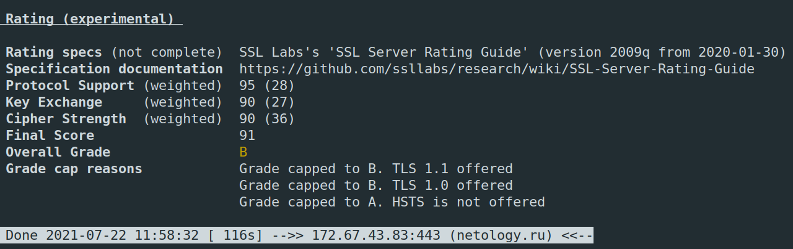  
5. #### Установите на Ubuntu ssh сервер, сгенерируйте новый приватный ключ. Скопируйте свой публичный ключ на другой сервер. Подключитесь к серверу по SSH-ключу.
   Создал [Dockerfile](Dockerfile)  
   `docker build . -t ssh_test` - сбилдим образ  
   `docker run --rm -d --name ssh_test1 ssh_test` - Запустим в 2 экземплярах как демоны  
   Подключимся к ssh_test1 `docker exec -it ssh_test1 /bin/bash`  
   `ssh-keygen` сгенерируем ключ    
   Подключимся к ssh_test2 и посмотрим ip ssh_test2 `ip -br a` -> 172.17.0.3/16  
   Подключимся к ssh_test1 и добавим свой публичный ключ на ssh_test2 `ssh-copy-id root@172.17.0.3`  
   Подключимся из ssh_test1 к ssh_test2 `ssh root@172.17.0.3`. Никаких паролей уже не требуется  
   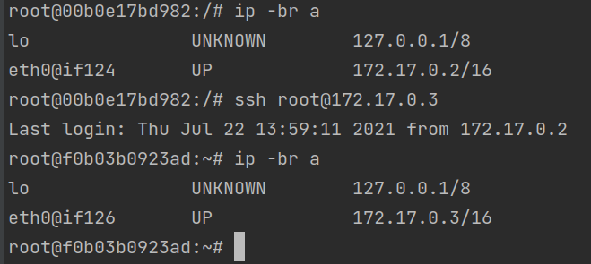  
6. #### Переименуйте файлы ключей из задания 5. Настройте файл конфигурации SSH клиента, так чтобы вход на удаленный сервер осуществлялся по имени сервера.
   `touch config && chmod 600 config`  
   Переименуем файлы id_rsa -> id_rsa1, id_rsa.pub -> id_rsa1.pub
   Добавим конфиг  
   ```
   Host test2
        HostName 172.17.0.3
        User root
        IdentityFile ~/.ssh/id_rsa1
   ```
   Подключимся через алиас  
   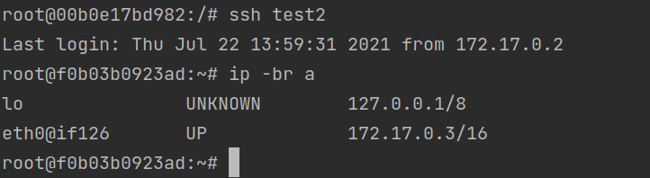  
7. #### Соберите дамп трафика утилитой tcpdump в формате pcap, 100 пакетов. Откройте файл pcap в Wireshark.
   `sudo tcpdump -c 100 -i wlp5s0 -w wifi_dump.pcap`  
   Откроем в cloudshark  
   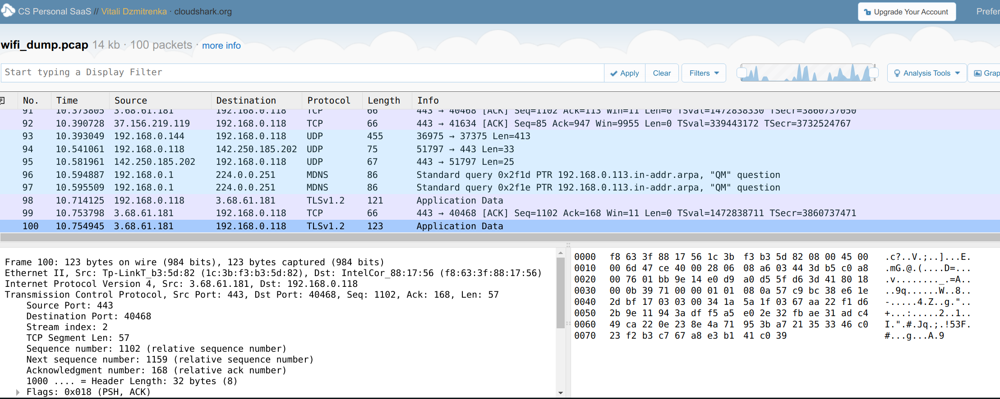
 ---
## Задание для самостоятельной отработки (необязательно к выполнению)

8. #### Просканируйте хост scanme.nmap.org. Какие сервисы запущены?
   `apt install nmap`  
   `nmap scanme.nmap.org`  
   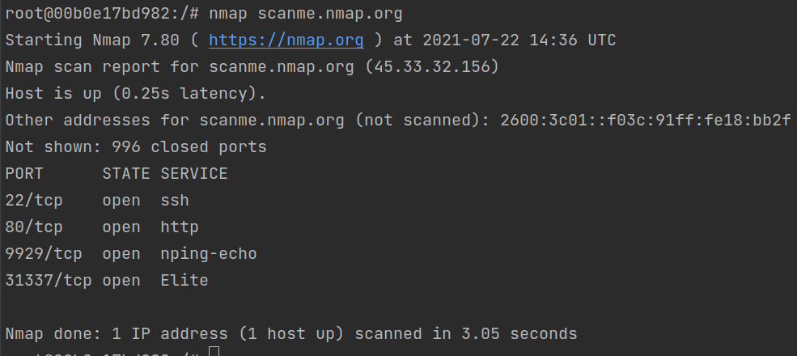  
9. #### Установите и настройте фаервол ufw на web-сервер из задания 3. Откройте доступ снаружи только к портам 22,80,443
   `apt install ufw`  
   Т.к. я уже благополучно убил сборку для 3 задания - я подниму 1 виртуалку, проброшу 3 порта и запрещу 1 из них фаерволом  
   Пропишем проброс портов в Vagrantfile   
   ```
   config.vm.network "forwarded_port", guest: 19999, host: 19999
   config.vm.network "forwarded_port", guest: 20000, host: 20000
   config.vm.network "forwarded_port", guest: 22, host: 1234
   ```
   `sudo ufw allow 19999/tcp`  
   `sudo ufw allow ssh/tcp`  
   `sudo ufw logging on`  
   
   Откроем новое окно и попробуем сделать ssh - `vagrant ssh` - работает  
   Будем слушать порт 19999 `nc -l  10.0.2.15 19999` на виртуалке, а из PC попытаемся отправить слово. На 19999 порт пакеты доходят  
   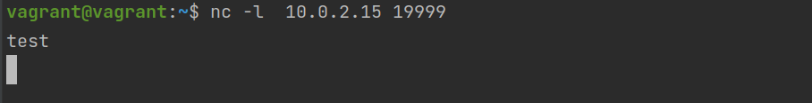  
   А вот на 20000 порт данные не падают. Посмотрим лог, который мы включили `tail -f /var/log/ufw.log`. Пакеты блокируются  
   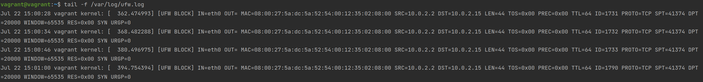