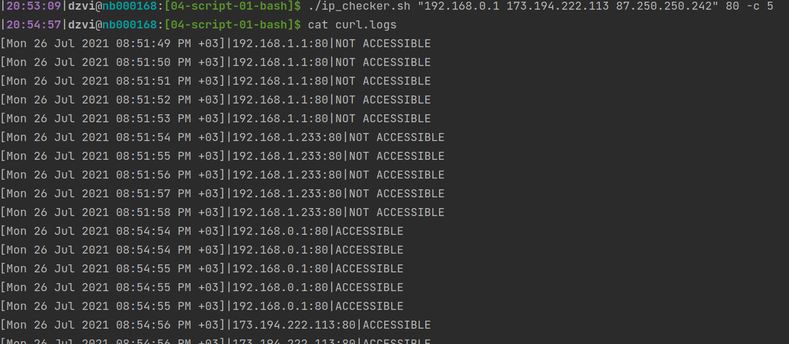

# Домашнее задание к занятию "4.1. Командная оболочка Bash: Практические навыки"

## Обязательные задания

1. #### Есть скрипт:
	```bash
	a=1
	b=2
	c=a+b
	d=$a+$b
	e=$(($a+$b))
	```
	* #### Какие значения переменным c,d,e будут присвоены?
      `c=a+b` -> a+b  
	  `d=$a+$b` -> 1+2  
	  `e=$(($a+$b))` -> 3
	* #### Почему?
	  Так происходит из-за того что мы объявили пременные неявно и bash по умолчанию считает их строками.
	  Кроме случая когда мы явно пытаемся выполнить арифметическую операцию (( )), в этом случае bash приводит (успешно) переменные 
	  к int и выполняет сложение
1. #### На нашем локальном сервере упал сервис и мы написали скрипт, который постоянно проверяет его доступность, записывая дату проверок до тех пор, пока сервис не станет доступным. В скрипте допущена ошибка, из-за которой выполнение не может завершиться, при этом место на Жёстком Диске постоянно уменьшается. Что необходимо сделать, чтобы его исправить:
	```bash
	while ((1==1)
	do
	  curl https://localhost:4757
	  if (($? != 0))
	  then
		date >> curl.log
	  fi
	done
	``` 
 	Доработаем след образом
	```bash
	 #!/usr/bin/env bash
	while ((1==1))
	do
	  curl http://localhost:4757 2>/dev/null
	  if (($? != 0))
	  then
	  	date >> curl.logs
	  else
		# Добавим условие выхода из цикла и завершения скрипта
		echo "Service is accessible"
		break
	  fi
	done
 	```
   Добавим условие выхода из цикла и завершения скрипта и занулим ошибки curl. Заметил особенность curl - если в ответ отправить 
   данные не по http протоколу он завершается все равно ошибкой. Сначала для проверки использовал `nc -l localhost 4757` и скрипт не отрабатывал.
   При более внимательном исследовании нашел эту особенность - что наверное логично. Использовал `python3 -m http.server 4757`
1. #### Необходимо написать скрипт, который проверяет доступность трёх IP: 192.168.0.1, 173.194.222.113, 87.250.250.242 по 80 порту и записывает результат в файл log. Проверять доступность необходимо пять раз для каждого узла.
   Набросал [скриптец](ip_checker.sh)
   `./ip_checker.sh "192.168.0.1 173.194.222.113 87.250.250.242" 80 -c 5`
   
1. #### Необходимо дописать скрипт из предыдущего задания так, чтобы он выполнялся до тех пор, пока один из узлов не окажется недоступным. Если любой из узлов недоступен - IP этого узла пишется в файл error, скрипт прерывается
   Доработал [скриптец](ip_checker.sh) - заменим цикл на while, добавим вывод в error.log и exit для выхода. 
   P.S. Почитал вопросы к ДЗ от коллег. Если надо оборвать выполнение только для ip который недоступен, а по другим проверки продолжить, 
   то вместо exit в строке 98 нужно воспользоваться break. Хотя в задании написано скрипт прерывается
## Дополнительное задание (со звездочкой*) - необязательно к выполнению

#### Мы хотим, чтобы у нас были красивые сообщения для коммитов в репозиторий. Для этого нужно написать локальный хук для git, который будет проверять, что сообщение в коммите содержит код текущего задания в квадратных скобках и количество символов в сообщении не превышает 30. Пример сообщения: \[04-script-01-bash\] сломал хук.
 Файл [commit-msg](commit-msg) нужно поместить в папку .git/hooks. Ну и тут его продублирую
 ```bash
 #!/usr/bin/env bash

# Get message from commit
msg=$(cat $1)

# Check message struct - [00-string-00-string]:string
if [[ $msg =~ ^\[[0-9]{2}-[a-z]{1,}-[0-9]{2}-[a-z]{1,}\]:. ]]; then
  # Check message lenght
  if [[ ${#msg} -gt 30 ]]; then
    echo "Message more than 30 symbols"
    # return error code 1 != 0
    exit 1
  fi
else
  echo "Message not in format [00-string-00-string]:string"
  # return error code 1 != 0
  exit 1
fi
 ```