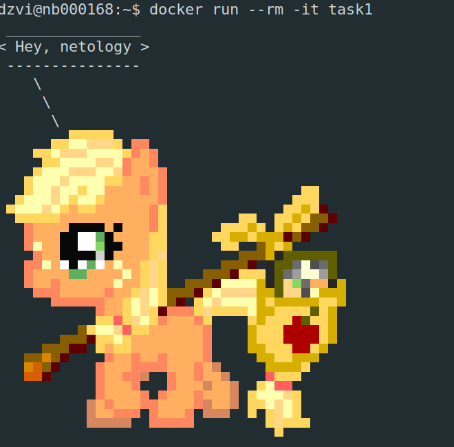
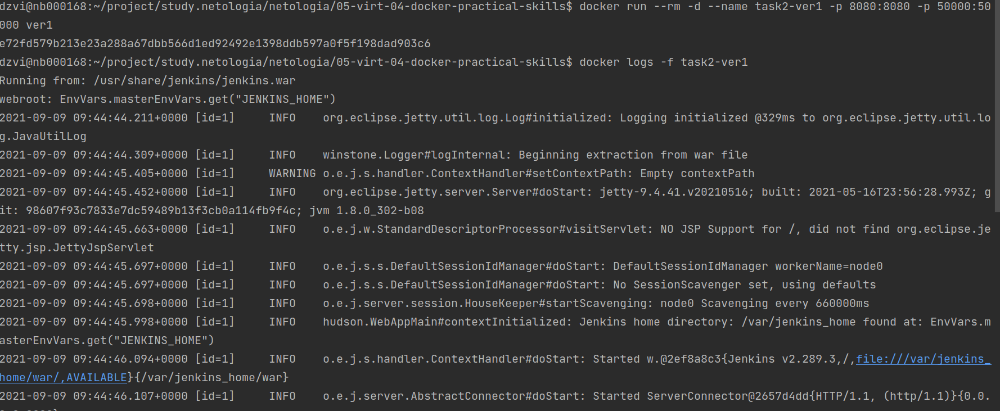
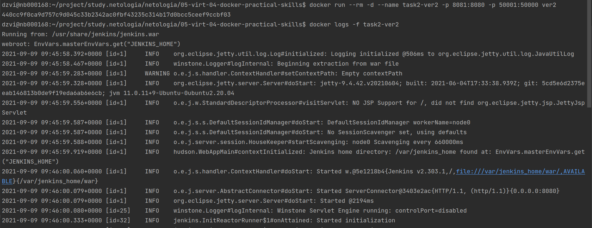
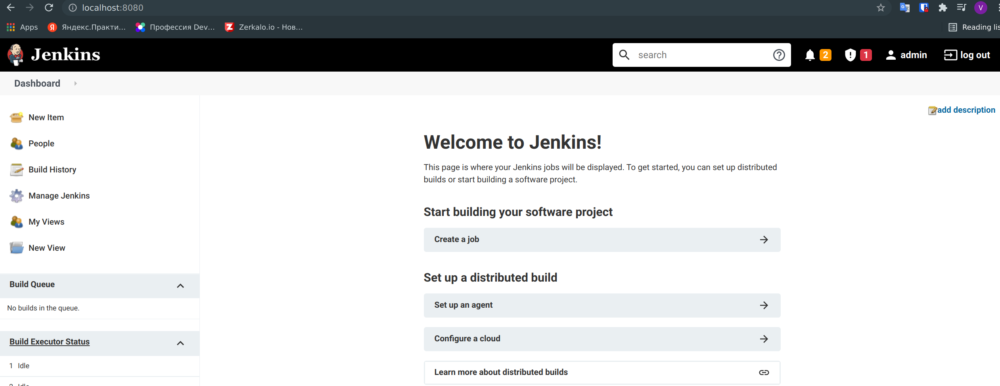
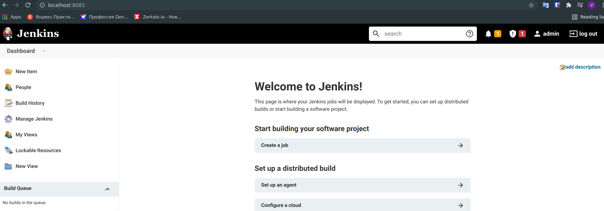
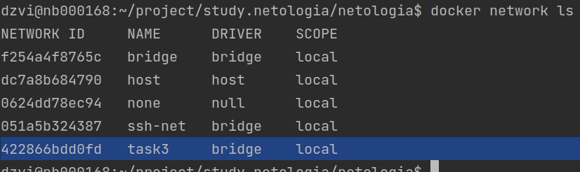
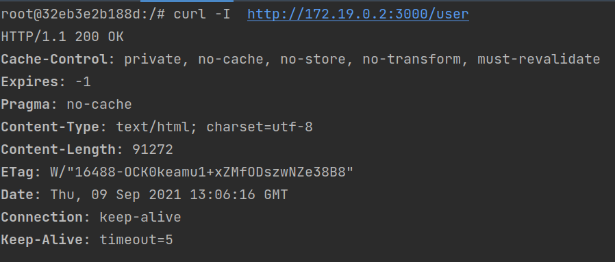

# Домашнее задание к занятию "5.4. Практические навыки работы с Docker"

## Задача 1 

####В данном задании вы научитесь изменять существующие Dockerfile, адаптируя их под нужный инфраструктурный стек.

####Измените базовый образ предложенного Dockerfile на Arch Linux c сохранением его функциональности.

```text
FROM ubuntu:latest


RUN apt-get update && \
    apt-get install -y software-properties-common && \
    add-apt-repository ppa:vincent-c/ponysay && \
    apt-get update
 
RUN apt-get install -y ponysay

ENTRYPOINT ["/usr/bin/ponysay"]
CMD ["Hey, netology”]
```

####Для получения зачета, вам необходимо предоставить:
- ####Написанный вами Dockerfile  
    [Dockerfile](Dockerfile.task1) 
- ####Скриншот вывода командной строки после запуска контейнера из вашего базового образа  
    
- ####Ссылку на образ в вашем хранилище docker-hub  
    [Image](https://hub.docker.com/layers/dzvi/netology/05-virt-04-docker-practical-skills-task1/images/sha256-9108d8a1f7b5594248b5d07b9d3fb6838e6f936c5b653a68476a7f46796e1384?context=repo)  
    Run `docker run --rm -it --name task1 dzvi/netology:05-virt-04-docker-practical-skills-task1`
## Задача 2 

####В данной задаче вы составите несколько разных Dockerfile для проекта Jenkins, опубликуем образ в `dockerhub.io` и посмотрим логи этих контейнеров.

- ####Составьте 2 Dockerfile:

    - ####Общие моменты:
        - ####Образ должен запускать [Jenkins server](https://www.jenkins.io/download/)
    - ####Спецификация первого образа:
        - ####Базовый образ - [amazoncorreto](https://hub.docker.com/_/amazoncorretto)
        - ####Присвоить образу тэг `ver1` 
        
    - ####Спецификация второго образа:
        - ####Базовый образ - [ubuntu:latest](https://hub.docker.com/_/ubuntu)
        - ####Присвоить образу тэг `ver2` 

- ####Соберите 2 образа по полученным Dockerfile
- ####Запустите и проверьте их работоспособность
- ####Опубликуйте образы в своём dockerhub.io хранилище
----
- ####Для получения зачета, вам необходимо предоставить:
- ####Наполнения 2х Dockerfile из задания
  [Dockerfile.task2.ver1](Dockerfile.task2.ver1)  
  Build: `docker build -t ver1 -f Dockerfile.task2.ver1 .`  
  [Dockerfile.task2.ver2](Dockerfile.task2.ver2)  
  Build: `docker build -t ver2 -f Dockerfile.task2.ver2 .`
- ####Скриншоты логов запущенных вами контейнеров (из командной строки)  
  `docker run --rm -d --name task2-ver2 -p 8081:8080 -p 50001:50000 ver2`  
  `docker logs -f task2-ver1`
    
  `docker run --rm -d --name task2-ver2 -p 8081:8080 -p 50001:50000 ver2`  
  `docker logs -f task2-ver2`  
    
- ####Скриншоты веб-интерфейса Jenkins запущенных вами контейнеров (достаточно 1 скриншота на контейнер)  
  `docker exec task2-ver1 cat /var/jenkins_home/secrets/initialAdminPassword`  
  
  `docker exec task2-ver2 cat /var/jenkins_home/secrets/initialAdminPassword`  
    
- ####Ссылки на образы в вашем хранилище docker-hub  
  [05-virt-04-docker-practical-skills-task2-ver1](https://hub.docker.com/layers/166457610/dzvi/netology/05-virt-04-docker-practical-skills-task2-ver1/images/sha256-e1d110f3cc999f6c7ffdf82df9b219ed27e565c8cbeeb82eef322100627dc1dc?context=repo)  
  Run `docker run --rm -it --name task2-ver1 -p 8080:8080 -p 50000:50000 dzvi/netology:05-virt-04-docker-practical-skills-task2-ver1`  
  [05-virt-04-docker-practical-skills-task2-ver2](https://hub.docker.com/layers/166442132/dzvi/netology/05-virt-04-docker-practical-skills-task2-ver2/images/sha256-eb3e7fe1086372290fff0e80adc6ad786a0ff2324f88b0095da495858f818596?context=repo)  
  Run `docker run --rm -it --name task2-ver2 -p 8080:8080 -p 50000:50000 dzvi/netology:05-virt-04-docker-practical-skills-task2-ver2`  
## Задача 3 

####В данном задании вы научитесь:
- ####объединять контейнеры в единую сеть
- ####исполнять команды "изнутри" контейнера

####Для выполнения задания вам нужно:
- ####Написать Dockerfile: 
    - ####Использовать образ https://hub.docker.com/_/node как базовый
    - ####Установить необходимые зависимые библиотеки для запуска npm приложения https://github.com/simplicitesoftware/nodejs-demo
    - ####Выставить у приложения (и контейнера) порт 3000 для прослушки входящих запросов  
    - ####Соберите образ и запустите контейнер в фоновом режиме с публикацией порта

- ####Запустить второй контейнер из образа ubuntu:latest 
- ####Создайть `docker network` и добавьте в нее оба запущенных контейнера
- ####Используя `docker exec` запустить командную строку контейнера `ubuntu` в интерактивном режиме
- ####Используя утилиту `curl` вызвать путь `/` контейнера с npm приложением  

####Для получения зачета, вам необходимо предоставить:
- ####Наполнение Dockerfile с npm приложением  
  [Dockerfile.task3](Dockerfile.task3)   
  Build `docker build -t task3 -f Dockerfile.task3 .`  
  Run `docker run --rm -it --name task3 -p 3000:3000 task3`  
  Run `docker run --rm -it --name ubuntu ubuntu`  
  Создадим сеть `docker network create task3`  
  Добавим контейнеры `docker network connect task3 task3` и `docker network connect task3 ubuntu`  
  Посмотрим `docker network inspect task3` IP нашего контейнера с приложением  
- ####Скриншот вывода вызова команды списка docker сетей (docker network cli)     
    
- ####Скриншот вызова утилиты curl с успешным ответом
  Из-за того что наше приложение ходит за информацией на сайт https://demo.dev.simplicite.io, 
  а он работает плохо и не отдает нужную информацию по каким-то там продуктам (путь `/` в нашем приложении), 
  будем ходить по пути "user" - чтобы получить информацию о нашем пользователе. Креды, кстати, логин и пароль по умолчанию тож не работают. Но
  по стечению абстоятельств их получилось угодать - `admin` `admin`. И теперь мы сможем 
  видеть какой-то ответ. Хотя врядли это важно для проверки знаний по настройке сетей в docker  
  
  