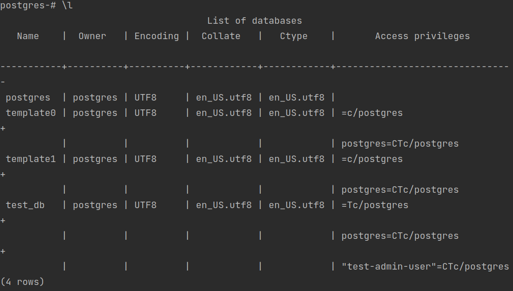
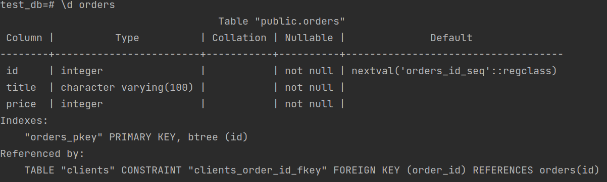
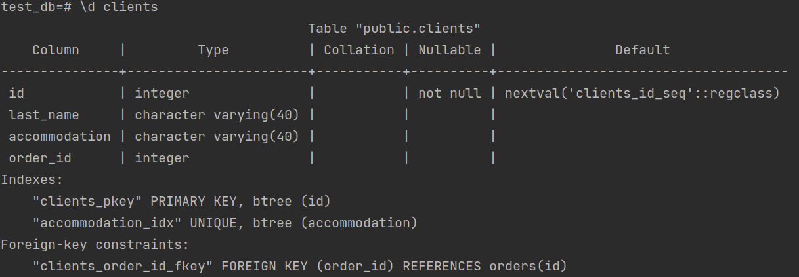
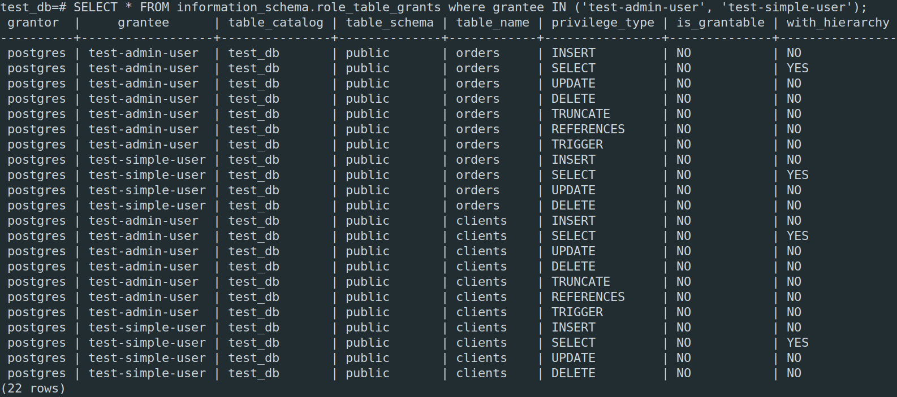
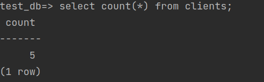
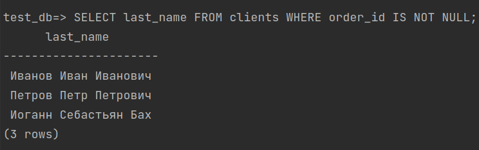
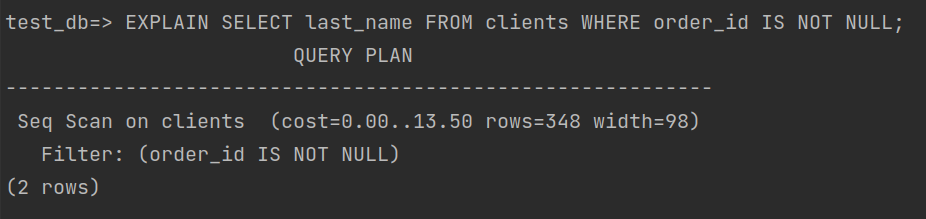

# Домашнее задание к занятию "6.2. SQL"

## Введение

####Перед выполнением задания вы можете ознакомиться с 
####[дополнительными материалами](https://github.com/netology-code/virt-homeworks/tree/master/additional/README.md).

## Задача 1

Используя docker поднимите инстанс PostgreSQL (версию 12) c 2 volume, 
в который будут складываться данные БД и бэкапы.

Приведите получившуюся команду или docker-compose манифест.

```sudo rm -rf pg_data/ && docker run --rm -d --name 06-db-02-postgres  -v "$PWD/pg_data":/var/lib/postgresql/data -v "$PWD/pg_backup":/var/lib/postgresql/backup -v "$PWD/pg_conf.conf":/etc/postgresql/postgresql.conf -v "$PWD/init.sql":/docker-entrypoint-initdb.d/ -e PGDATA=/var/lib/postgresql/data -e POSTGRES_PASSWORD=postgres postgres:12```  
_Тут присутсвует sudo rm -rf pg_data/ т.к. если папку не очистить, то при рестарте не будут выполняться автоматичски скрипты инициализации из папки docker-entrypoint-initdb.d/_ т.к база уже будет создана. Для первого старта можно убрать  
Подключаться будем под нашим админом - ```docker exec -it 06-db-02-postgres psql -U test-admin-user -d test_db```  
## Задача 2

В БД из задачи 1: 
- создайте пользователя test-admin-user и БД test_db
- в БД test_db создайте таблицу orders и clients (спeцификация таблиц ниже)
- предоставьте привилегии на все операции пользователю test-admin-user на таблицы БД test_db
- создайте пользователя test-simple-user  
- предоставьте пользователю test-simple-user права на SELECT/INSERT/UPDATE/DELETE данных таблиц БД test_db

Таблица orders:
- id (serial primary key)
- наименование (string)
- цена (integer)

Таблица clients:
- id (serial primary key)
- фамилия (string)
- страна проживания (string, index)
- заказ (foreign key orders)

Приведите:
- #### итоговый список БД после выполнения пунктов выше,  
 
- #### описание таблиц (describe)  
   
   
- #### SQL-запрос для выдачи списка пользователей с правами над таблицами test_db
  ```SELECT * FROM information_schema.role_table_grants where grantee IN ('test-admin-user', 'test-simple-user');```  
  Можно и без условий для всех пользователей для всех сущностей, но вывод будет большой из-за дефолтного суперпользователя postgres
- #### список пользователей с правами над таблицами test_db  
  

## Задача 3

#### Используя SQL синтаксис - наполните таблицы следующими тестовыми данными:

Таблица orders

|Наименование|цена|
|------------|----|
|Шоколад| 10 |
|Принтер| 3000 |
|Книга| 500 |
|Монитор| 7000|
|Гитара| 4000|

Таблица clients

|ФИО|Страна проживания|
|------------|----|
|Иванов Иван Иванович| USA |
|Петров Петр Петрович| Canada |
|Иоганн Себастьян Бах| Japan |
|Ронни Джеймс Дио| Russia|
|Ritchie Blackmore| Russia|

Используя SQL синтаксис:
- #### вычислите количество записей для каждой таблицы
- #### приведите в ответе:
    - #### запросы 
    task3 блок в файле [init.sql](init.sql)
    - #### результаты их выполнения.
      
    Для orders вывод аналогичный  
## Задача 4

Часть пользователей из таблицы clients решили оформить заказы из таблицы orders.

Используя foreign keys свяжите записи из таблиц, согласно таблице:

|ФИО|Заказ|
|------------|----|
|Иванов Иван Иванович| Книга |
|Петров Петр Петрович| Монитор |
|Иоганн Себастьян Бах| Гитара |

#### Приведите SQL-запросы для выполнения данных операций.
task4 блок в файле [init.sql](init.sql)
#### Приведите SQL-запрос для выдачи всех пользователей, которые совершили заказ, а также вывод данного запроса.
```SELECT last_name FROM clients WHERE order_id IS NOT NULL;```  
  
Подсказк - используйте директиву `UPDATE`.

## Задача 5

#### Получите полную информацию по выполнению запроса выдачи всех пользователей из задачи 4 
#### (используя директиву EXPLAIN).

#### Приведите получившийся результат и объясните что значат полученные значения.  
    
  *cost - Приблизительная стоимость запуска. Это время, которое проходит, прежде чем начнётся этап вывода данных, например время сотировки.   
  После 2 точек - приблизительная общая стоимость. на вычисляется в предположении, что узел плана выполняется до конца, 
  то есть возвращает все доступные строки  
  *rows=348 - Число строк для поиска результата. Получается не эффективный запрос. Вообще не очень понятно почему 348 
  строк для поиска, если в таблице только 5 и найти объяснения не получилось  
  *width=98 - жидаемый средний размер строк  
  *key - не показано т.к. нету индексов для поиска  
## Задача 6

#### Создайте бэкап БД test_db и поместите его в volume, предназначенный для бэкапов (см. Задачу 1).
```pg_dump --file /var/lib/postgresql/backup/$(date +"%F"_"%T").sql --create --dbname test_db --username postgres``` - 
это только БД, без пользователей  
```pg_dumpall -f /var/lib/postgresql/backup/$(date +"%F"_"%T").sql -l test_db -U postgres``` - это БД + users. Испольщовал это  
#### Остановите контейнер с PostgreSQL (но не удаляйте volumes).
#### Поднимите новый пустой контейнер с PostgreSQL.
#### Поднимем контейнер  06-db-02-postgres_empty, но подключим к нему только volume с бекапом  

```docker run 
--rm -d --name 06-db-02-postgres_empty -p 5432:5432 -v "$PWD/pg_backup":/var/lib/postgresql/backup -v "$PWD/pg_conf.conf":/etc/postgresql/postgresql.c
onf -e POSTGRES_PASSWORD=postgres -e  postgres:12
```  
#### Восстановите БД test_db в новом контейнере.  
```psql -U postgres -f /var/lib/postgresql/backup/2021-09-21_20:01:07.sql postgres```  
#### Приведите список операций, который вы применяли для бэкапа данных и восстановления.  
см. выше  