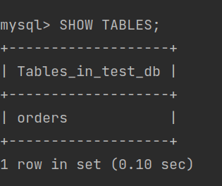
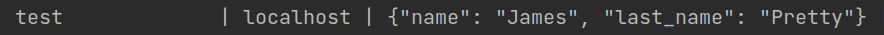
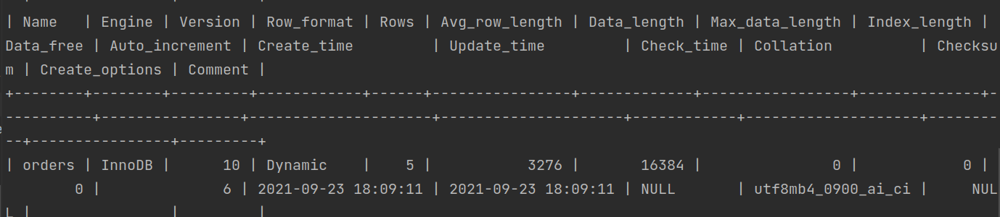
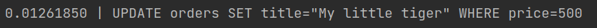
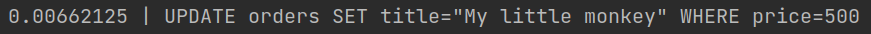

# Домашнее задание к занятию "6.3. MySQL"

## Введение

#### Перед выполнением задания вы можете ознакомиться с 
[дополнительными материалами](https://github.com/netology-code/virt-homeworks/tree/master/additional/README.md).

## Задача 1

#### Используя docker поднимите инстанс MySQL (версию 8). Данные БД сохраните в volume.
```sudo rm -rf ms_data/ && docker run --rm --name 06-db-03-mysql -v "$PWD/ms_data":/var/lib/mysql -v "$PWD/test_dump.sql":/tmp/test_dump.sql -e MYSQL_DATABASE=test_db -e MYSQL_USER=user -e MYSQL_PASSWORD=pwd -e MYSQL_ROOT_PASSWORD=pw -d mysql:8```
```docker exec -it 06-db-03-mysql mysql -uroot -p```

#### Изучите [бэкап БД](https://github.com/netology-code/virt-homeworks/tree/master/06-db-03-mysql/test_data) и 
#### восстановитесь из него.
```docker exec -i 06-db-03-mysql sh -c 'exec mysql -D test_db -uroot -p"$MYSQL_ROOT_PASSWORD"' < "$PWD/test_dump.sql"```
#### Перейдите в управляющую консоль `mysql` внутри контейнера.
```mysql -D test_db -uuser -p```
#### Используя команду `\h` получите список управляющих команд.

#### Найдите команду для выдачи статуса БД и **приведите в ответе** из ее вывода версию сервера БД.  
status -> ```Server version:         8.0.26 MySQL Community Server - GPL```
#### Подключитесь к восстановленной БД и получите список таблиц из этой БД.
```SHOW TABLES;```  
  
#### **Приведите в ответе** количество записей с `price` > 300.
```SELECT count(*) FROM orders WHERE price > 300;```  
  
#### В следующих заданиях мы будем продолжать работу с данным контейнером.

## Задача 

#### Создайте пользователя test в БД c паролем test-pass, используя:
#### - плагин авторизации mysql_native_password
#### - срок истечения пароля - 180 дней 
#### - количество попыток авторизации - 3 
#### - максимальное количество запросов в час - 100
#### - аттрибуты пользователя:
####     - Фамилия "Pretty"
####     - Имя "James"
```CREATE USER 'test'@'localhost' IDENTIFIED WITH mysql_native_password BY 'test-pass' WITH MAX_QUERIES_PER_HOUR 100 PASSWORD EXPIRE INTERVAL 180 DAY  FAILED_LOGIN_ATTEMPTS 3 ATTRIBUTE '{"name": "James", "last_name": "Pretty"}';```
#### Предоставьте привелегии пользователю `test` на операции SELECT базы `test_db`.
``` GRANT SELECT ON test_db.* TO 'test'@'localhost';```
#### Используя таблицу INFORMATION_SCHEMA.USER_ATTRIBUTES получите данные по пользователю `test` и 
#### **приведите в ответе к задаче**.
  

## Задача 3

#### Установите профилирование `SET profiling = 1`.
#### Изучите вывод профилирования команд `SHOW PROFILES;`.

#### Исследуйте, какой `engine` используется в таблице БД `test_db` и **приведите в ответе**.
```SHOW TABLE STATUS FROM test_db;```  
  
#### Измените `engine` и **приведите время выполнения и запрос на изменения из профайлера в ответе**:
```ALTER TABLE orders ENGINE = MyISAM;```  
#### - на `MyISAM`  
  
#### - на `InnoDB`  
  

## Задача 4 

Изучите файл `my.cnf` в директории /etc/mysql.

Измените его согласно ТЗ (движок InnoDB):
#### - Скорость IO важнее сохранности данных
innodb_flush_log_at_trx_commit = 1 для случаев, когда сохранность данных – это приоритет номер один.  
innodb_flush_log_at_trx_commit = 2 для случаев, когда небольшая потеря данных не критична (например, вы используете   
дублирование и сможете восстановить небольшую потерю). В этом случае транзакции будут сбрасываться в лог на диск только раз в секунду.  
#### - Нужна компрессия таблиц для экономии места на диске  
1. innodb_compress_debug - Все таблицы по умолчанию с компрессией. У нас такой переменной нет. Выбираем вариант 2 _This 
2. option is only available if debugging support is compiled in using the WITH_DEBUG CMake option._  
3. innodb_file_per_table=1 и при создании таблицы указываем ROW_FORMAT=COMPRESSED   
#### - Размер буффера с незакомиченными транзакциями 1 Мб  
innodb_log_buffer_size - Это размер буфера транзакций, которые не были еще закомичены. Значение этого параметра стоит 
менять в случаях, если вы используете большие поля вроде BLOB или TEXT.  
#### - Буффер кеширования 30% от ОЗУ  
innodb_buffer_pool_size - Устанавливайте это значение максимально возможным для Вашей системы. Буфер InnoDB кеширует и 
данные и индексы. Поэтому значение этого ключа стоит устанавливать в 70%…80% всей доступной памяти.  
У меня 16G - выставлено в 5G
#### - Размер файла логов операций 100 Мб  
innodb_log_file_size - Эта опция влияет на скорость записи. Она устанавливает размер лога операций (так операции сначала 
записываются в лог, а потом применяются к данным на диске). Чем больше этот лог, тем быстрее будут работать записи (т.к. 
их поместится больше в файл лога). Файлов всегда два, а их размер одинаковый. Значением параметра задается размер одного файла  

[Рекомендации по настройке](https://highload.today/index-php-2009-04-23-optimalnaya-nastroyka-mysql-servera/)

#### Приведите в ответе измененный файл `my.cnf`.  
Проверить конфиг - ```mysqld --validate-config```  
[my.cnf](my.cnf)