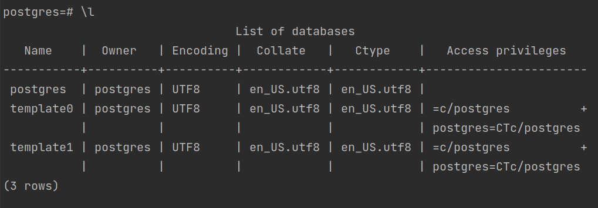
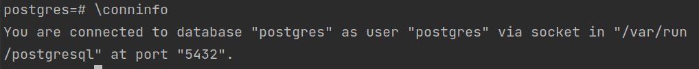
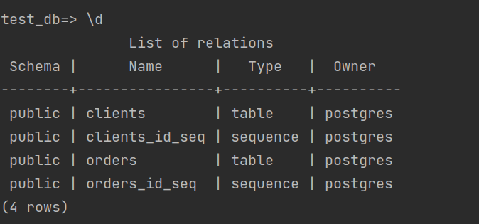
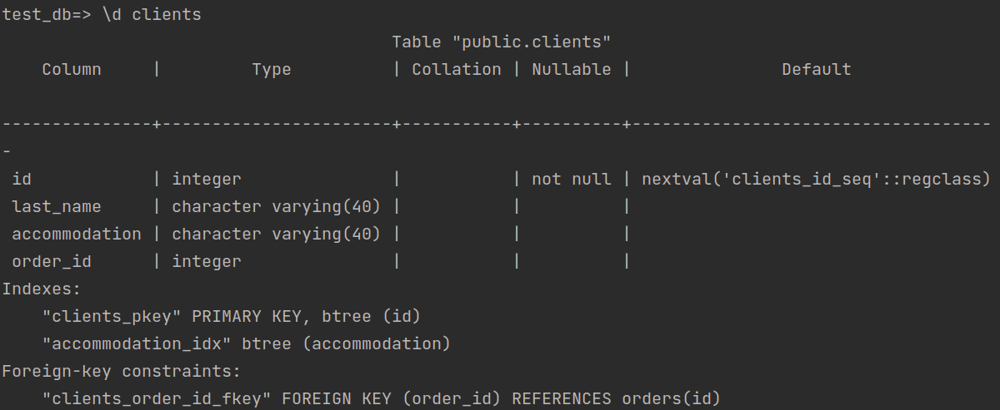
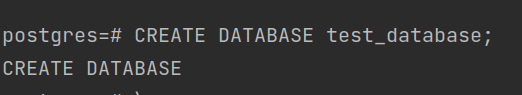
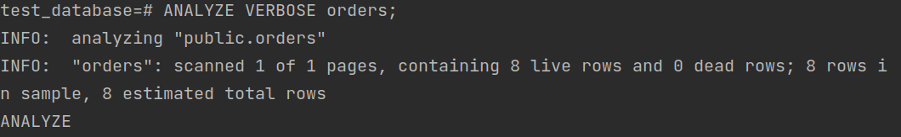
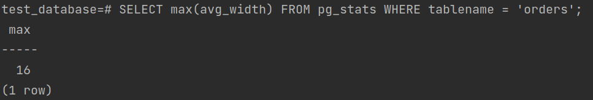

# Домашнее задание к занятию "6.4. PostgreSQL"

## Задача 1

#### Используя docker поднимите инстанс PostgreSQL (версию 13). Данные БД сохраните в volume.
```sudo rm -rf pg_data/ && docker run --rm -d --name 06-db-04-postgres  -v "$PWD/pg_data":/var/lib/postgresql/data -e PGDATA=/var/lib/postgresql/data -e POSTGRES_PASSWORD=postgres postgres:13```
#### Подключитесь к БД PostgreSQL используя `psql`.
```docker exec -it 06-db-04-postgres psql -U postgres```
#### Воспользуйтесь командой `\?` для вывода подсказки по имеющимся в `psql` управляющим командам.

#### **Найдите и приведите** управляющие команды для:
#### - вывода списка БД  
  ```\l```  
    
#### - подключения к БД  
  ```\conninfo```  
    
#### - вывода списка таблиц  
  ```\d```  
  
#### - вывода описания содержимого таблиц
  ```\d table```  
  
#### - выхода из psql
  ```\q```

## Задача 2

#### Используя `psql` создайте БД `test_database`.
  
#### Изучите [бэкап БД](https://github.com/netology-code/virt-homeworks/tree/master/06-db-04-postgresql/test_data).
#### Восстановите бэкап БД в `test_database`.
```psql -U postgres -d test_database < /tmp/test_dump.sql```  
#### Перейдите в управляющую консоль `psql` внутри контейнера.
#### Подключитесь к восстановленной БД и проведите операцию ANALYZE для сбора статистики по таблице.
    
#### Используя таблицу [pg_stats](https://postgrespro.ru/docs/postgresql/12/view-pg-stats), найдите столбец таблицы `orders` 
#### с наибольшим средним значением размера элементов в байтах.  
####**Приведите в ответе** команду, которую вы использовали для вычисления и полученный результат.
```SELECT max(avg_width) FROM pg_stats WHERE tablename = 'orders';```  
    

## Задача 3

#### Архитектор и администратор БД выяснили, что ваша таблица orders разрослась до невиданных размеров и
#### поиск по ней занимает долгое время. Вам, как успешному выпускнику курсов DevOps в нетологии предложили
#### провести разбиение таблицы на 2 (шардировать на orders_1 - price>499 и orders_2 - price<=499).

#### Предложите SQL-транзакцию для проведения данной операции.
 
```
    BEGIN;
    CREATE TABLE orders_1 (CHECK ( price > 499 ) ) INHERITS (orders);
    CREATE TABLE orders_2 (CHECK ( price <= 499 ) ) INHERITS (orders);
    
    CREATE RULE orders_insert_price_more_499 AS ON INSERT TO orders WHERE (price > 499) DO INSTEAD INSERT INTO orders_1 VALUES (NEW.*);
    CREATE RULE orders_insert_price_less_499 AS ON INSERT TO orders WHERE (price <= 499) DO INSTEAD INSERT INTO orders_2 VALUES (NEW.*);
    COMMIT;
```

#### Можно ли было изначально исключить "ручное" разбиение при проектировании таблицы orders?
Да, указав при создании таблицы orders ```PARTITION BY RANGE (price);``` 
И создав секции вида 
```CREATE TABLE orders_section1 PARTITION OF orders FOR VALUES FROM (min) TO (max);```

## Задача 4

#### Используя утилиту `pg_dump` создайте бекап БД `test_database`.
```pg_dump -U postgres test_database > /tmp/dump.sql```

#### Как бы вы доработали бэкап-файл, чтобы добавить уникальность значения столбца `title` для таблиц `test_database`?
Добавим UNIQUE ограничение
```
    CREATE TABLE public.orders (
      id integer NOT NULL,
      title character varying(80) **UNIQUE** NOT NULL,
      price integer DEFAULT 0
    );
```

