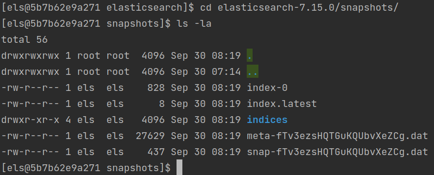

# Домашнее задание к занятию "6.5. Elasticsearch"

## Задача 1

#### В этом задании вы потренируетесь в:
#### - установке elasticsearch
#### - первоначальном конфигурировании elastcisearch
#### - запуске elasticsearch в docker

#### Используя докер образ [centos:7](https://hub.docker.com/_/centos) как базовый и 
#### [документацию по установке и запуску Elastcisearch](https://www.elastic.co/guide/en/elasticsearch/reference/current/targz.html):

#### - составьте Dockerfile-манифест для elasticsearch
  [Dockerfile](Dockerfile)   
#### - соберите docker-образ и сделайте `push` в ваш docker.io репозиторий
  ```docker build -t els -f Dockerfile .```
#### - запустите контейнер из получившегося образа и выполните запрос пути `/` c хост-машины
  ``` docker run --rm -m 2GB --memory-swap -1 --name 06-db-05-els -p 9200:9200 -it els:latest```
#### Требования к `elasticsearch.yml`:
#### - данные `path` должны сохраняться в `/var/lib`
  elasticsearch.yml -> path.data: /var/lib/elasitcsearch/data
#### - имя ноды должно быть `netology_test`
  elasticsearch.yml -> node.name: netology_test
#### В ответе приведите:
#### - текст Dockerfile манифеста
  [Dockerfile](Dockerfile)
#### - ссылку на образ в репозитории dockerhub
  [docker.hub image](https://hub.docker.com/layers/dzvi/netology/06-db-05-elasticsearch/images/sha256-899e78f3a8dacbda665767093ccba391e4c3f8642f315c766bd1c278ba10fac0?context=explore)
#### - ответ `elasticsearch` на запрос пути `/` в json виде
```json
{
  "name" : "netology_test",
  "cluster_name" : "elasticsearch",
  "cluster_uuid" : "_na_",
  "version" : {
    "number" : "7.15.0",
    "build_flavor" : "default",
    "build_type" : "tar",
    "build_hash" : "79d65f6e357953a5b3cbcc5e2c7c21073d89aa29",
    "build_date" : "2021-09-16T03:05:29.143308416Z",
    "build_snapshot" : false,
    "lucene_version" : "8.9.0",
    "minimum_wire_compatibility_version" : "6.8.0",
    "minimum_index_compatibility_version" : "6.0.0-beta1"
  },
  "tagline" : "You Know, for Search"
}
```
#### Подсказки:
#### - возможно вам понадобится установка пакета perl-Digest-SHA для корректной работы пакета shasum
#### - при сетевых проблемах внимательно изучите кластерные и сетевые настройки в elasticsearch.yml
#### - при некоторых проблемах вам поможет docker директива ulimit
#### - elasticsearch в логах обычно описывает проблему и пути ее решения

#### Далее мы будем работать с данным экземпляром elasticsearch.

## Задача 2

#### В этом задании вы научитесь:
#### - создавать и удалять индексы
#### - изучать состояние кластера
#### - обосновывать причину деградации доступности данных

#### Ознакомтесь с [документацией](https://www.elastic.co/guide/en/elasticsearch/reference/current/indices-create-index.html) 
#### и добавьте в `elasticsearch` 3 индекса, в соответствии со таблицей:

| Имя | Количество реплик | Количество шард |
|-----|-------------------|-----------------|
| ind-1| 0 | 1 |
| ind-2 | 1 | 2 |
| ind-3 | 2 | 4 |

```curl -XPUT 'localhost:9200/ind-1' -H 'Content-Type: application/json' -d'{"settings" : {"index" : {"number_of_shards" : 1, "number_of_replicas" : 0 }}}'```  
```curl -XPUT 'localhost:9200/ind-2' -H 'Content-Type: application/json' -d'{"settings" : {"index" : {"number_of_shards" : 2, "number_of_replicas" : 1 }}}'```  
```curl -XPUT 'localhost:9200/ind-3' -H 'Content-Type: application/json' -d'{"settings" : {"index" : {"number_of_shards" : 3, "number_of_replicas" : 2 }}}'```  

====> ```{"acknowledged":true,"shards_acknowledged":true,"index":"ind-N"}```

#### Получите список индексов и их статусов, используя API и **приведите в ответе** на задание.
```curl http://localhost:9200/_cat/indices```  

green  open .geoip_databases 53YZWWJTRg-DAJHUKuWEyQ 1 0 43 0 40.7mb 40.7mb  
green  open ind-1            lrgqIHuATGeJtBVA0ITznA 1 0  0 0   208b   208b  
yellow open ind-3            axD0urtcTC2S9gDprwV8eQ 3 2  0 0   624b   624b  
yellow open ind-2            12kAigYHT0qt3FbhYNCkoQ 2 1  0 0   416b   416b  

#### Получите состояние кластера `elasticsearch`, используя API.
```curl http://localhost:9200/_cluster/health```

```json
{"cluster_name":"elasticsearch","status":"yellow","timed_out":false,"number_of_nodes":1,"number_of_data_nodes":1,"active_primary_shards":7,"active_shards":7,"relocating_shards":0,"initializing_shards":0,"unassigned_shards":8,"delayed_unassigned_shards":0,"number_of_pending_tasks":0,"number_of_in_flight_fetch":0,"task_max_waiting_in_queue_millis":0,"active_shards_percent_as_number":46.666666666666664}
```

#### Как вы думаете, почему часть индексов и кластер находится в состоянии yellow?
Часть индексов находится в состоянии yellow т.к. у нас только одна нода, а для некоторых индексов мы указали несколько 
реплик (там где не указали реплики - green), а для реплик нужны разные ноды.

Кластер находится в состоянии yellow т.к. несколько шардов в состоянии unassigned о чем и говорит вывод - "unassigned_shards":8.

#### Удалите все индексы.
```curl -X DELETE "localhost:9200/ind-N"```
{"acknowledged":true}

#### **Важно**

#### При проектировании кластера elasticsearch нужно корректно рассчитывать количество реплик и шард,
#### иначе возможна потеря данных индексов, вплоть до полной, при деградации системы.

## Задача 3

#### В данном задании вы научитесь:
#### - создавать бэкапы данных
#### - восстанавливать индексы из бэкапов

#### Создайте директорию `{путь до корневой директории с elasticsearch в образе}/snapshots`.

#### Используя API [зарегистрируйте](https://www.elastic.co/guide/en/elasticsearch/reference/current/snapshots-register-repository.html#snapshots-register-repository) 
#### данную директорию как `snapshot repository` c именем `netology_backup`.

#### **Приведите в ответе** запрос API и результат вызова API для создания репозитория.
```curl -X PUT "localhost:9200/_snapshot/netology_backup" -H 'Content-Type: application/json' -d'{ "type": "fs", "settings": {"location": "/opt/elasticsearch/elasticsearch-7.15.0/snapshots"}}'```  
-=> ```{"acknowledged":true}```   
```curl localhost:9200/_snapshot/_all``` -> ```{"netology_backup":{"type":"fs","settings":{"location":"/opt/elasticsearch/elasticsearch-7.15.0/snapshots"}}}```  
#### Создайте индекс `test` с 0 реплик и 1 шардом и **приведите в ответе** список индексов.
green open .geoip_databases dvyHckIxTNmJ2mV49IT7kg 1 0 43 0 41.1mb 41.1mb  
green open test             nUuPhob6T-ONZt9h_L6kqQ 1 0  0 0   208b   208b  

#### [Создайте `snapshot`](https://www.elastic.co/guide/en/elasticsearch/reference/current/snapshots-take-snapshot.html) 
#### состояния кластера `elasticsearch`.
```curl -X PUT "localhost:9200/_snapshot/netology_backup/snapshot_1?wait_for_completion=true&pretty"```

#### **Приведите в ответе** список файлов в директории со `snapshot`ами.
    
#### Удалите индекс `test` и создайте индекс `test-2`. **Приведите в ответе** список индексов.
``` curl -X DELETE "localhost:9200/test"```  
```curl -XPUT 'localhost:9200/test-2' -H 'Content-Type: application/json' -d'{"settings" : {"index" : {"number_of_shards" : 1, "number_of_replicas" : 0 }}}'```  
green open test-2           OpW7TD-9TsuWy-qQdok6OA 1 0  0 0   208b   208b   
green open .geoip_databases dvyHckIxTNmJ2mV49IT7kg 1 0 43 0 41.1mb 41.1mb   
#### [Восстановите](https://www.elastic.co/guide/en/elasticsearch/reference/current/snapshots-restore-snapshot.html) состояние
#### кластера `elasticsearch` из `snapshot`, созданного ранее.
#### **Приведите в ответе** запрос к API восстановления и итоговый список индексов.
```curl -X POST "localhost:9200/_snapshot/netology_backup/snapshot_1/_restore?pretty" -H 'Content-Type: application/json' -d' { "indices": "test"}'```

green open test-2           OpW7TD-9TsuWy-qQdok6OA 1 0  0 0   208b   208b  
green open .geoip_databases dvyHckIxTNmJ2mV49IT7kg 1 0 43 0 41.1mb 41.1mb  
green open test             pSpVi-2hSpeeSEOtKQ506Q 1 0  0 0   208b   208b  

#### Подсказки:
#### - возможно вам понадобится доработать `elasticsearch.yml` в части директивы `path.repo` и перезапустить `elasticsearch`
