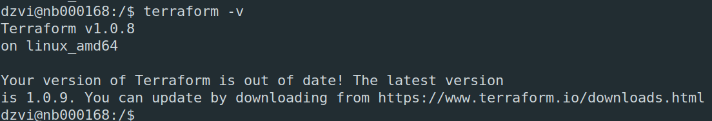
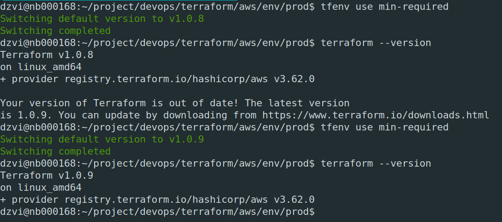

# Домашнее задание к занятию "7.1. Инфраструктура как код"

## Задача 1. Выбор инструментов. 
 
### Легенда
 
#### Через час совещание на котором менеджер расскажет о новом проекте. Начать работу над которым надо 
#### будет уже сегодня. 
#### На данный момент известно, что это будет сервис, который ваша компания будет предоставлять внешним заказчикам.
#### Первое время, скорее всего, будет один внешний клиент, со временем внешних клиентов станет больше.

#### Так же по разговорам в компании есть вероятность, что техническое задание еще не четкое, что приведет к большому
#### количеству небольших релизов, тестирований интеграций, откатов, доработок, то есть скучно не будет.  

#### Вам, как девопс инженеру, будет необходимо принять решение об инструментах для организации инфраструктуры.
#### На данный момент в вашей компании уже используются следующие инструменты: 
#### - остатки Сloud Formation, 
#### - некоторые образы сделаны при помощи Packer,
#### - год назад начали активно использовать Terraform, 
#### - разработчики привыкли использовать Docker, 
#### - уже есть большая база Kubernetes конфигураций, 
#### - для автоматизации процессов используется Teamcity, 
#### - также есть совсем немного Ansible скриптов, 
#### - и ряд bash скриптов для упрощения рутинных задач.  

#### Для этого в рамках совещания надо будет выяснить подробности о проекте, что бы в итоге определиться с инструментами:

#### 1. Какой тип инфраструктуры будем использовать для этого проекта: изменяемый или не изменяемый?
Неизменяемый - упростит процесс разработки - доставку, тестирование, откаты + уже есть опыт работы с Docker и k8s.
#### 2. Будет ли центральный сервер для управления инфраструктурой?
Скорее нет т.к. инструменты, которые предпологается использовать и с которыми уже есть опыт не предпологают его наличия.
#### 3. Будут ли агенты на серверах?
Точно для сбора метрик - например node exporter. Для terraform и ansible агенты не нужны.
#### 4. Будут ли использованы средства для управления конфигурацией или инициализации ресурсов? 
Да - Terraform - универсальное решение, в отличии от Сloud Formation. Описать сразу в виде кода, дабы было что-то 
готовое для инициализации будущих разверток. 
#### В связи с тем, что проект стартует уже сегодня, в рамках совещания надо будет определиться со всеми этими вопросами.

### В результате задачи необходимо

#### 1. Ответить на четыре вопроса представленных в разделе "Легенда". 
#### 1. Какие инструменты из уже используемых вы хотели бы использовать для нового проекта? 
Terraform, Docker, k8s, Ansible. По необходимоти bash
#### 1. Хотите ли рассмотреть возможность внедрения новых инструментов для этого проекта? 
У нас уже есть опыт при работе с этими мощными инструментами, которые скорее всего закроют необходимый функционал. Но все 
завсисит от конечного ТЗ. Однозначно рассмотрим его детально и выберем наиболее подходящие инструменты.
#### Если для ответа на эти вопросы недостаточно информации, то напишите какие моменты уточните на совещании.
Самое главное нужно узнать где будем хоститься - в облаке или on-premise. От этого будет сильно зависеть выбор инструеметов
 и подходов. Нужно узнать что из себя будет представлять сервис? Будут ли использоваться БД? Файловые хранилища? По 
хорошему иметь описания процесса разработки для его автоматизации.

## Задача 2. Установка терраформ. 

#### Официальный сайт: https://www.terraform.io/

#### Установите терраформ при помощи менеджера пакетов используемого в вашей операционной системе.
#### В виде результата этой задачи приложите вывод команды `terraform --version`.
  

## Задача 3. Поддержка легаси кода. 

#### В какой-то момент вы обновили терраформ до новой версии, например с 0.12 до 0.13. 
#### А код одного из проектов настолько устарел, что не может работать с версией 0.13. 
#### В связи с этим необходимо сделать так, чтобы вы могли одновременно использовать последнюю версию терраформа установленную при помощи
#### штатного менеджера пакетов и устаревшую версию 0.12. 

#### В виде результата этой задачи приложите вывод `--version` двух версий терраформа доступных на вашем компьютере 
#### или виртуальной машине.
Вариантов несколько - т.к. terraform это бинарник, то можно скачать 2 версии и сделать на них алиасы вида terr12, 
terr13  

Второй вариант более правильный - воспользуемся утилитой tfenv
Установим необходимые версии. В моем случае есть проект с версией 1.0.8 и более новая верися 1.0.9. Установим их
```tfenv install 1.0.8``` и ```tfenv install 1.0.9```  
Заходим в папку с проектом ```tfenv use min-required```. Поменяем версию в required_version на 1.0.9 и выполним еще раз  
  