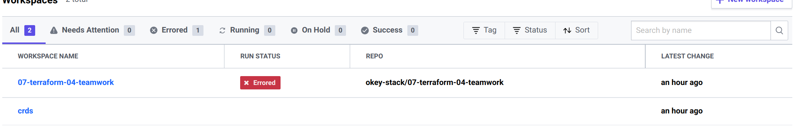
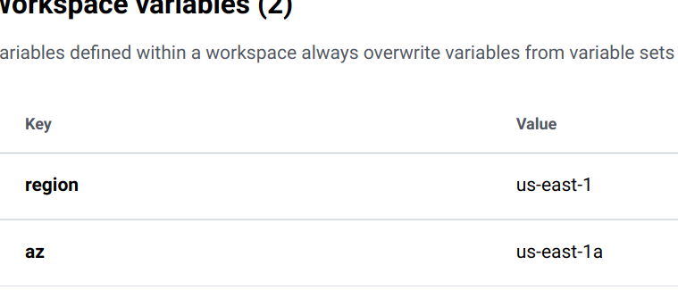
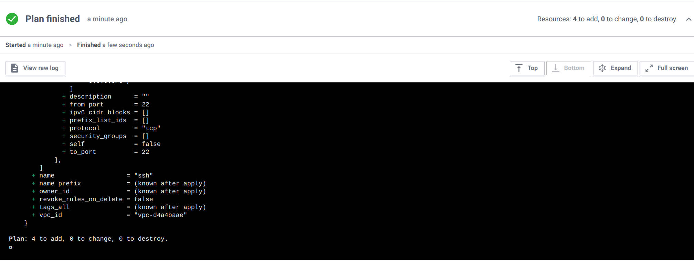

# Домашнее задание к занятию "7.4. Средства командной работы над инфраструктурой."

## Задача 1. Настроить terraform cloud (необязательно, но крайне желательно).

В это задании предлагается познакомиться со средством командой работы над инфраструктурой предоставляемым
разработчиками терраформа. 

1. #### Зарегистрируйтесь на [https://app.terraform.io/](https://app.terraform.io/).
(регистрация бесплатная и не требует использования платежных инструментов).
1. #### Создайте в своем github аккаунте (или другом хранилище репозиториев) отдельный репозиторий с
 конфигурационными файлами прошлых занятий (или воспользуйтесь любым простым конфигом).
1. #### Зарегистрируйте этот репозиторий в [https://app.terraform.io/](https://app.terraform.io/).
1. #### Выполните plan и apply. 

В качестве результата задания приложите снимок экрана с успешным применением конфигурации.

Зарегистрировался, создал отдельный репозиторий и создал workspace. 

Прописал несколько переменных прямо в ui.  
  
Запустить не получилось т.к. креды нужно добавить. Пользователь у меня корпаротивный и светить его не хотелось, так что я 
в этом направлении дальше не пошел.
Добавим в конфиг и залогиниимся, предварительно создав токен в tfc
```terraform
backend "remote" {
    organization = "07-terraform-04-teamwork"

    workspaces {
      name = "07-terraform-04-teamwork"
    }
  }
```
Чтобы можно было запускать хотя бы plan с локальной машины
  
В настройках можно настроить локальное выполнение, но тогда tfc отслеживать будет только state

## Задача 2. Написать серверный конфиг для атлантиса. 

Смысл задания – познакомиться с документацией 
 [серверной](https://www.runatlantis.io/docs/server-side-repo-config.html) конфигурации и конфигурации уровня 
 [репозитория](https://www.runatlantis.io/docs/repo-level-atlantis-yaml.html).

#### Создай `server.yaml` который скажет атлантису:
1. #### Укажите, что атлантис должен работать только для репозиториев в вашем github (или любом другом) аккаунте.
  ```repo-allowlist: "github.com/okey-stack/07-terraform-04-teamwork/"```
2. #### На стороне клиентского конфига разрешите изменять `workflow`, то есть для каждого репозитория можно 
#### будет указать свои дополнительные команды.
  ``` allow_custom_workflows: true```
3. #### В `workflow` используемом по-умолчанию сделайте так, что бы во время планирования не происходил `lock` состояния.
  ```- plan: extra_args: ["-lock", "false"]```

Создай `atlantis.yaml` который, если поместить в корень terraform проекта, скажет атлантису:
1. #### Надо запускать планирование и аплай для двух воркспейсов `stage` и `prod`.
  Нужно описать раздел project для каждого workspace
2. #### Необходимо включить автопланирование при изменении любых файлов `*.tf`.
```yaml
  autoplan:
    when_modified: ["*.tf"]
    enabled: true
```
#### В качестве результата приложите ссылку на файлы `server.yaml` и `atlantis.yaml`.

Создали небольшой [докерфайл](atlantis-dockerfile)  
запускаем сервер ```docker run -p 4141:4141 atlantis:latest server --config /tmp/server.yaml --repo-config /tmp/repo.yaml```
Передав в качестве аргумента файлы конфигураций [server.yaml](server.yaml) и [repo.yaml](repo.yaml)

Для того чтобы можно было переопределять настройки воркфлоу проекта на клиентской стороне нужно в конфиге задать allowed_overrides
[atlantis](atlantis.yaml)

## Задача 3. Знакомство с каталогом модулей. 

1. ####  В [каталоге модулей](https://registry.terraform.io/browse/modules) найдите официальный модуль от aws для создания
`ec2` инстансов. 
2. ####  Изучите как устроен модуль. Задумайтесь, будете ли в своем проекте использовать этот модуль или непосредственно 
ресурс `aws_instance` без помощи модуля?
3. ####  В рамках предпоследнего задания был создан ec2 при помощи ресурса `aws_instance`. 
#### Создайте аналогичный инстанс при помощи найденного модуля.   

#### В качестве результата задания приложите ссылку на созданный блок конфигураций. 
Вместо закомментированного блока используем модкль. 
```terraform
//resource "aws_instance" "web" {
//  ami                         = data.aws_ami.ubuntu.id
//  instance_type               = local.instance_type.test
//  availability_zone           = var.az
//  associate_public_ip_address = true
//  vpc_security_group_ids      = [aws_security_group.ssh.name]
//  count                       = local.instance_count.test
//  tags = {
//    Name = "Ubuntu-server"
//  }
//  depends_on = [aws_security_group.ssh]
//}

module "ec2_instance" {
  source  = "terraform-aws-modules/ec2-instance/aws"
  version = "~> 3.0"

  name = "single-instance"

  ami                    = data.aws_ami.ubuntu.id
  instance_type          = local.instance_type.test
  key_name               = aws_security_group.ssh.name
  monitoring             = true
  vpc_security_group_ids = [aws_security_group.ssh.name]

  tags = {
    Terraform   = "true"
    Name = "Ubuntu-server"
  }
}
```