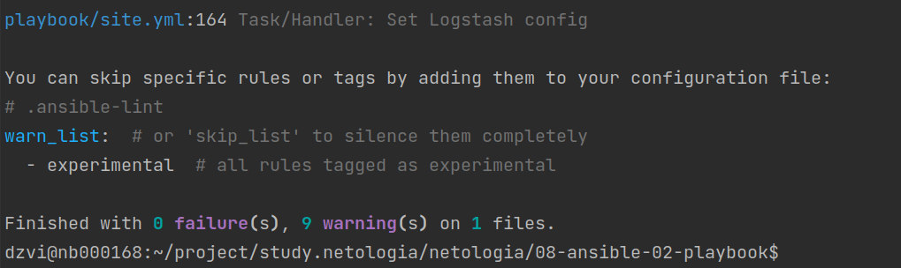
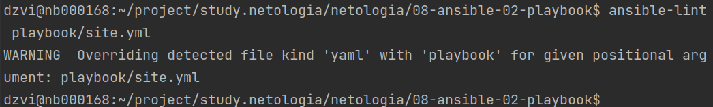

# Домашнее задание к занятию "08.02 Работа с Playbook"

## Подготовка к выполнению
1. #### Создайте свой собственный (или используйте старый) публичный репозиторий на github с произвольным именем.
2. #### Скачайте [playbook](./playbook/) из репозитория с домашним заданием и перенесите его в свой репозиторий.
3. #### Подготовьте хосты в соотвтествии с группами из предподготовленного playbook.
    Запустим контейнер `docker run --rm -di --name ubuntu pycontribs/ubuntu`  
    Изменим инвентори:  
    ```yaml
    hosts:
      ubuntu:
        ansible_connection: docker
    ```
4. #### Скачайте дистрибутив [java](https://www.oracle.com/java/technologies/javase-jdk11-downloads.html) и положите его в директорию `playbook/files/`. 

## Основная часть
1. #### Приготовьте свой собственный inventory файл `prod.yml`.
2. #### Допишите playbook: нужно сделать ещё один play, который устанавливает и настраивает kibana.
3. #### При создании tasks рекомендую использовать модули: `get_url`, `template`, `unarchive`, `file`.
4. #### Tasks должны: скачать нужной версии дистрибутив, выполнить распаковку в выбранную директорию, сгенерировать конфигурацию с параметрами.
5. #### Запустите `ansible-lint site.yml` и исправьте ошибки, если они есть.  
   Ошибок нет, есть только warning'и  
     
   На всякий случай проставим права для всех архивов и папок с котрыми работаем  
     
6. #### Попробуйте запустить playbook на этом окружении с флагом `--check`.
7. #### Запустите playbook на `prod.yml` окружении с флагом `--diff`. Убедитесь, что изменения на системе произведены.
    ```ansible-playbook -i inventory/prod.yml site.yml --diff```  
8. #### Повторно запустите playbook с флагом `--diff` и убедитесь, что playbook идемпотентен.
    ```ansible-playbook -i inventory/prod.yml site.yml --tags [elastic,kibana] --diff```     
9. #### Подготовьте README.md файл по своему playbook. В нём должно быть описано: что делает playbook, какие у него есть параметры и теги.
   В [файле](playbook/README.md) описаны основные разделы и используемые флаги
10. #### Готовый playbook выложите в свой репозиторий, в ответ предоставьте ссылку на него.
   Основная часть задания протегирована и досткпна по [ссылке](https://github.com/okey-stack/devops-netology/tree/08-a-01-pb.main/08-ansible-02-playbook) 
## Необязательная часть

1. #### Приготовьте дополнительный хост для установки logstash.
   ```yaml
    - name: Run logstash container
      docker_container:
        name: logstash
        recreate: yes
        force_kill: true
        image: pycontribs/ubuntu
        command: sleep infinity
      tags: env
   ```
2. #### Пропишите данный хост в `prod.yml` в новую группу `logstash`.
   ```yaml
   logstash:
     hosts:
       logstash:
         ansible_connection: docker
         ansible_user: root
   ```
3. #### Дополните playbook ещё одним play, который будет исполнять установку logstash только на выделенный для него хост.
   ```yaml
   ...
   - name: Install Logstash
     hosts: logstash
       tasks:
   ...
   ```
4. #### Все переменные для нового play определите в отдельный файл `group_vars/logstash/vars.yml`.
   ```yaml
   logstash_version: "7.15.2"
   logstash_home: "/opt/logstash/{{ logstash_version }}"
   elasticsearch_addr: elasticsearch # container name
   ```
5. #### Logstash конфиг должен конфигурироваться в части ссылки на elasticsearch (можно взять, например его IP из facts или определить через vars).
   ```yaml
   elasticsearch_addr: elasticsearch # container name
   ```
6. #### Дополните README.md, протестируйте playbook, выложите новую версию в github. В ответ предоставьте ссылку на репозиторий.
---

### Как оформить ДЗ?

Выполненное домашнее задание пришлите ссылкой на .md-файл в вашем репозитории.

---
