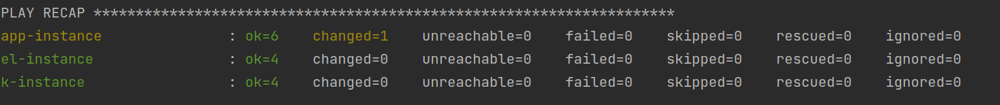
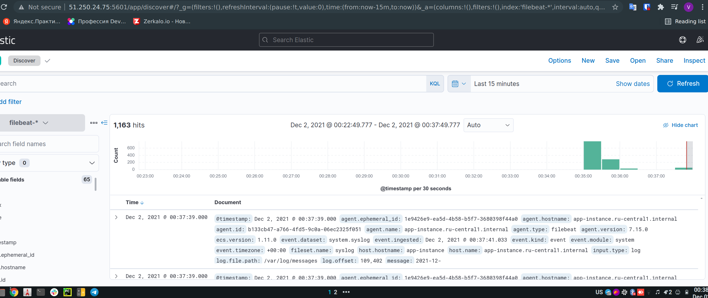

# Домашнее задание к занятию "08.03 Использование Yandex Cloud"

## Подготовка к выполнению
1. #### Создайте свой собственный (или используйте старый) публичный репозиторий на github с произвольным именем.
2. #### Скачайте [playbook](./playbook/) из репозитория с домашним заданием и перенесите его в свой репозиторий.

## Основная часть
1. #### Допишите playbook: нужно сделать ещё один play, который устанавливает и настраивает kibana.
   ```yaml
   - name: Install Kibana
     hosts: kibana
     handlers:
       - name: restart Kibana
         become: true
         service:
           name: kibana
           state: restarted
     tasks:
       - name: "Download Kibana's rpm"
         get_url:
           url: "https://artifacts.elastic.co/downloads/kibana/kibana-{{ elk_stack_version }}-x86_64.rpm"
           dest: "/tmp/kibana-{{ elk_stack_version }}-x86_64.rpm"
         register: download_kibana
         until: download_kibana is succeeded
       - name: Install Kibana
         become: true
         yum:
           name: "/tmp/kibana-{{ elk_stack_version }}-x86_64.rpm"
           state: present
       - name: Configure Kibana
         become: true
         template:
           src: kibana.yml.j2
           dest: /etc/kibana/kibana.yml
           mode: 0644
         notify: restart Kibana
   ```
2. #### При создании tasks рекомендую использовать модули: `get_url`, `template`, `yum`, `apt`.
3. #### Tasks должны: скачать нужной версии дистрибутив, выполнить распаковку в выбранную директорию, сгенерировать конфигурацию с параметрами.
4. #### Приготовьте свой собственный inventory файл `prod.yml`.
   ```yaml
   elasticsearch:
     hosts:
       el-instance:
         ansible_host: 51.250.28.34
         ansible_user: yandex
   kibana:
     hosts:
       k-instance:
         ansible_host: 51.250.24.75
         ansible_user: yandex
   app:
     hosts:
       app-instance:
         ansible_host: 51.250.22.231
         ansible_user: yandex
   ```
5. #### Запустите `ansible-lint site.yml` и исправьте ошибки, если они есть.
      
6. #### Попробуйте запустить playbook на этом окружении с флагом `--check`.  
    ```ansible-playbook -i playbook/inventory/prod playbook/site.yml --check```  
     
7. #### Запустите playbook на `prod.yml` окружении с флагом `--diff`. Убедитесь, что изменения на системе произведены.
     
8. #### Повторно запустите playbook с флагом `--diff` и убедитесь, что playbook идемпотентен.
     
9. #### Проделайте шаги с 1 до 8 для создания ещё одного play, который устанавливает и настраивает filebeat.
     
     
10. #### Подготовьте README.md файл по своему playbook. В нём должно быть описано: что делает playbook, какие у него есть параметры и теги.
11. #### Готовый playbook выложите в свой репозиторий, в ответ предоставьте ссылку на него.