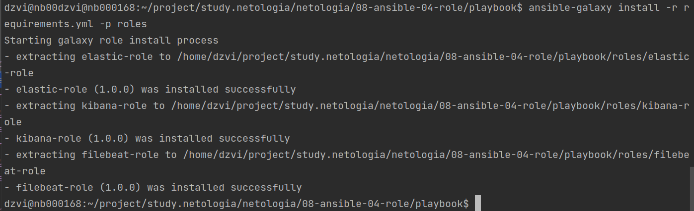
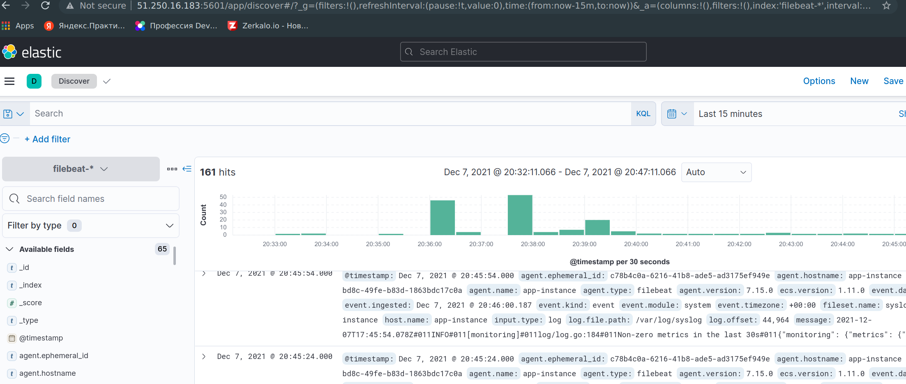

# Домашнее задание к занятию "8.4 Работа с Roles"

## Подготовка к выполнению
1. #### Создайте два пустых публичных репозитория в любом своём проекте: kibana-role и filebeat-role.
2. #### Добавьте публичную часть своего ключа к своему профилю в github.

## Основная часть

#### Наша основная цель - разбить наш playbook на отдельные roles. Задача: сделать roles для elastic, kibana, filebeat и написать playbook для использования этих ролей. Ожидаемый результат: существуют два ваших репозитория с roles и один репозиторий с playbook.

1. #### Создать в старой версии playbook файл `requirements.yml` и заполнить его следующим содержимым:
   ```yaml
   ---
     - src: git@github.com:netology-code/mnt-homeworks-ansible.git
       scm: git
       version: "2.0.0"
       name: elastic 
   ```
2. #### При помощи `ansible-galaxy` скачать себе эту роль.  
   `ansible-galaxy install -r requirements.yml -p roles`
3. #### Создать новый каталог с ролью при помощи `ansible-galaxy role init kibana-role`.
4. #### На основе tasks из старого playbook заполните новую role. Разнесите переменные между `vars` и `default`. 
5. #### Перенести нужные шаблоны конфигов в `templates`.
6. #### Создать новый каталог с ролью при помощи `ansible-galaxy role init filebeat-role`.
7. #### На основе tasks из старого playbook заполните новую role. Разнесите переменные между `vars` и `default`. 
8. #### Перенести нужные шаблоны конфигов в `templates`.
9. #### Описать в `README.md` обе роли и их параметры.
10. #### Выложите все roles в репозитории. Проставьте тэги, используя семантическую нумерацию.
11. #### Добавьте roles в `requirements.yml` в playbook.
   ```yaml
   - src: git@github.com:okey-stack/ansible-elasticsearch-role.git
     scm: git
     version: "1.0.0"
     name: elastic-role
   - src: git@github.com:okey-stack/ansible-kibana-role.git
     scm: git
     version: "1.0.0"
     name: kibana-role
   - src: git@github.com:okey-stack/ansible-filebeat-role.git
     scm: git
     version: "1.0.0"
     name: filebeat-role
   ```
12. #### Переработайте playbook на использование roles.
   ```yaml
   - name: Install elasticsearch-role
     hosts: elasticsearch
     roles:
       - elastic-role
   - name: Install kibana-role
     hosts: kibana
     roles:
       - kibana-role
   - name: Install filebeat-role
     hosts: app
     roles:
       - filebeat-role
   ```
13. #### Выложите playbook в репозиторий.
14. #### В ответ приведите ссылки на оба репозитория с roles и одну ссылку на репозиторий с playbook.
   [kibana](https://github.com/okey-stack/ansible-kibana-role)  
   [elasticsearch](https://github.com/okey-stack/ansible-elasticsearch-role)  
   [filebeat](https://github.com/okey-stack/ansible-filebeat-role)  

   Проверим работу на серверах с Debian 10
     
   Все поднялось  
     
   
## Необязательная часть

1. Проделайте схожие манипуляции для создания роли logstash.
2. Создайте дополнительный набор tasks, который позволяет обновлять стек ELK.
3. Убедитесь в работоспособности своего стека: установите logstash на свой хост с elasticsearch, настройте конфиги logstash и filebeat так, чтобы они взаимодействовали друг с другом и elasticsearch корректно.
4. Выложите logstash-role в репозиторий. В ответ приведите ссылку.