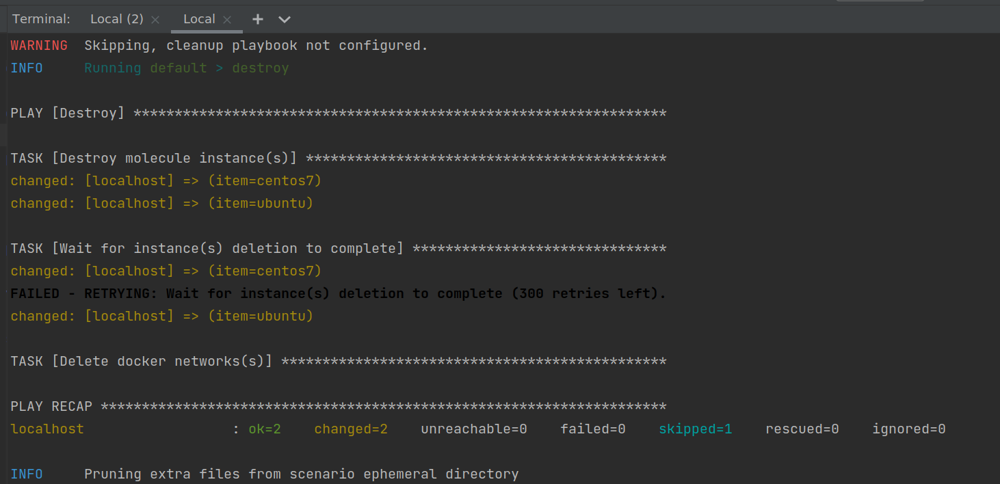

# Домашнее задание к занятию "08.05 Тестирование Roles"

## Подготовка к выполнению
1. #### Установите molecule: `pip3 install "molecule==3.4.0"`
2. #### Соберите локальный образ на основе [Dockerfile](./Dockerfile)
  Регистрируемся [тут](https://developers.redhat.com/)  
  логинимся `docker login https://registry.redhat.io`  
  билдим `docker build -t molecule .`
  запускаем `docker run --rm --privileged=True -v $(pwd):/opt/elasticsearch-role -w /opt/elasticsearch-role -it molecule /bin/bash`
## Основная часть

Наша основная цель - настроить тестирование наших ролей. Задача: сделать сценарии тестирования для kibana, logstash. Ожидаемый результат: все сценарии успешно проходят тестирование ролей.

### Molecule

1. #### Запустите  `molecule test` внутри корневой директории elasticsearch-role, посмотрите на вывод команды.
     
   
2. #### Перейдите в каталог с ролью kibana-role и создайте сценарий тестирования по умолчаню при помощи `molecule init scenario --driver-name docker`.
   1. Спулим все наши роли из пердыдущего задания  
      1. `git clone git@github.com:okey-stack/ansible-elasticsearch-role.git`  
      2. `git clone git@github.com:okey-stack/ansible-kibana-role.git`  
      3. `git clone git@github.com:okey-stack/ansible-filebeat-role.git`
   2. Создадим и активируем окружение  
      `virtualenv .env`
      `. .env/bin/activate`
      `pip3 install -r requirements.txt --force`
   3. Добавим test сначала в роль ansible-elasticsearch-role
      `molecule init scenario --driver-name docker`  
   4. Добавим настроек в platform для запуска контейнера с systemd, уберем условие перезапуска сервис в handlers
   5. `mkdir molecule/default/files`
   6. `molecule test`
3. #### Добавьте несколько разных дистрибутивов (centos:8, ubuntu:latest) для инстансов и протестируйте роль, исправьте найденные ошибки, если они есть.
   1. Проделаем тоже самое для роли ansible-kibana-role
   2. Дополнительно добавим в converge запуск роли ansible-elasticsearch-role т.к. без бд kibana не запускается (возвращает ошибки при попытке обратиться через http)
   3. Добавим несколько проверок в файл verify.yml
   4. 1.т.к. Centos8 использует другой менеджер пакетов - dnf. 
   5. Добавим импорт PGP key через доп таску в install
   6. Добавим default ip elastic в templates
4. #### Добавьте несколько assert'ов в verify.yml файл, для  проверки работоспособности kibana-role (проверка, что web отвечает, проверка логов, etc). Запустите тестирование роли повторно и проверьте, что оно прошло успешно.
   Добавим проверку на логин и наличие логов
5. #### Повторите шаги 2-4 для filebeat-role.
6. #### Добавьте новый тег на коммит с рабочим сценарием в соответствии с семантическим версионированием.

### Tox

1. #### Запустите `docker run --privileged=True -v <path_to_repo>:/opt/elasticsearch-role -w /opt/elasticsearch-role -it <image_name> /bin/bash`, где path_to_repo - путь до корня репозитория с elasticsearch-role на вашей файловой системе.
2. #### Внутри контейнера выполните команду `tox`, посмотрите на вывод.
3. #### Добавьте файл `tox.ini` в корень репозитория каждой своей роли.
4. #### Создайте облегчённый сценарий для `molecule`. Проверьте его на исполнимость.
5. #### Пропишите правильную команду в `tox.ini` для того чтобы запускался облегчённый сценарий.
6. #### Запустите `docker` контейнер так, чтобы внутри оказались обе ваши роли.
7. #### Зайдти поочерёдно в каждую из них и запустите команду `tox`. Убедитесь, что всё отработало успешно.
8. #### Добавьте новый тег на коммит с рабочим сценарием в соответствии с семантическим версионированием.

После выполнения у вас должно получится два сценария molecule и один tox.ini файл в каждом репозитории. Ссылки на репозитории являются ответами на домашнее задание. Не забудьте указать в ответе теги решений Tox и Molecule заданий.

   Для тестирования того что я тут наделал):
   1. Клонируете 3 репозитория с ролями (как указано выше). Все репозитории протегированы в соответствии с заданием 1.1.0 - molecule 1.2.0 - tox
   2. Создаете окружение и устанавливаете зависимости из файла [requirements](requirements.txt)
   3. Переходите в роль и запускаете `molecule test`
   4. Для тестирования tox переходите в роль и запускаете `tox`

## Необязательная часть

1. Проделайте схожие манипуляции для создания роли logstash.
2. Создайте дополнительный набор tasks, который позволяет обновлять стек ELK.
3. В ролях добавьте тестирование в раздел `verify.yml`. Данный раздел должен проверять, что logstash через команду `logstash -e 'input { stdin { } } output { stdout {} }'`  отвечате адекватно.
4. Создайте сценарий внутри любой из своих ролей, который умеет поднимать весь стек при помощи всех ролей.
5. Убедитесь в работоспособности своего стека. Создайте отдельный verify.yml, который будет проверять работоспособность интеграции всех инструментов между ними.
6. Выложите свои roles в репозитории. В ответ приведите ссылки.

---
