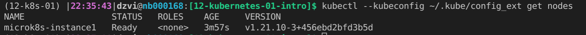
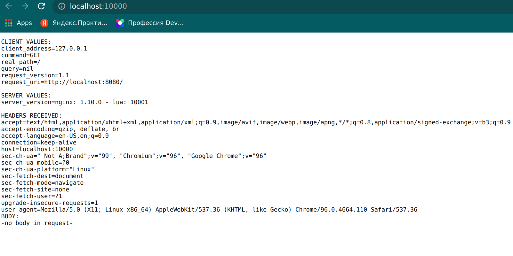

1. Создадим виртуалку в yandex cloud - microk8s-instance (OS - Ubuntu 20.04, HDD - 20, CPU - 4, RAM - 8GB)
2. Копируем внешний IP и вставляем в [файл](playbook/inventory/prod/hosts.yml) вместе с именем пользователя
3. Запускаем `ansible-playbook -i playbook/inventory/prod/hosts.yml playbook/site.yml`
4. У Вас появился файл ~/.kube/config_ext. Его можно использовать для подключенияя с помощью `kubectl --kubeconfig ~/.kube/config_ext command`
5. Проверим `kubectl --kubeconfig ~/.kube/config_ext get nodes`
     
6. Проверим наше приложение. Запустим `kubectl --kubeconfig ~/.kube/config_ext port-forward -n default service/hello-world 10000:8080` и сходим в браузере [cюда](http://localhost:10000)  
   