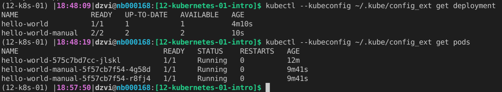
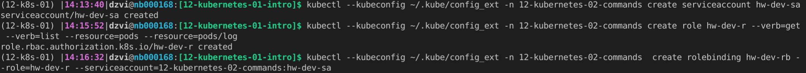
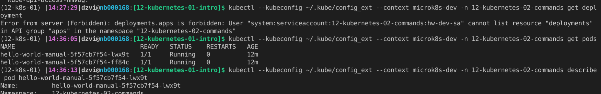
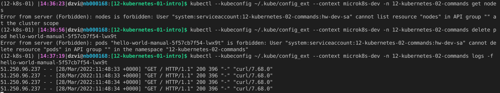
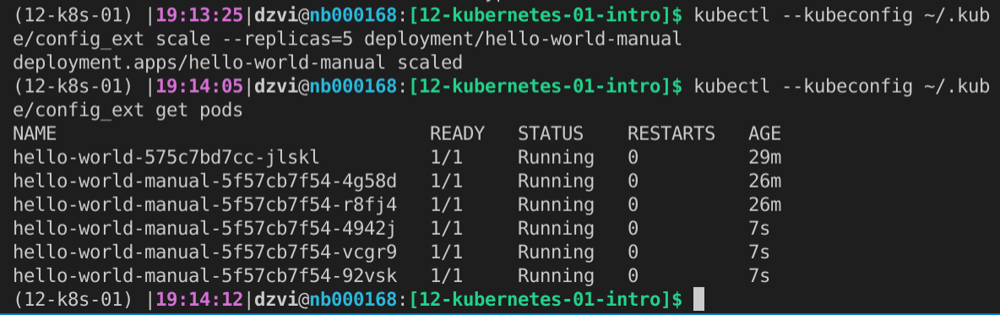

# Домашнее задание к занятию "12.2 Команды для работы с Kubernetes"
Кластер — это сложная система, с которой крайне редко работает один человек. Квалифицированный devops умеет наладить работу всей команды, занимающейся каким-либо сервисом.
После знакомства с кластером вас попросили выдать доступ нескольким разработчикам. Помимо этого требуется служебный аккаунт для просмотра логов.

## Задание 1: Запуск пода из образа в деплойменте
Для начала следует разобраться с прямым запуском приложений из консоли. Такой подход поможет быстро развернуть инструменты отладки в кластере. Требуется запустить деплоймент на основе образа из hello world уже через deployment. Сразу стоит запустить 2 копии приложения (replicas=2). 

Требования:
 * пример из hello world запущен в качестве deployment
 * количество реплик в deployment установлено в 2
 * наличие deployment можно проверить командой kubectl get deployment
 * наличие подов можно проверить командой kubectl get pods

1. Воспользуемся скриптом из [предыдущего](https://github.com/okey-stack/devops-netology/tree/main/12-kubernetes-01-intro) домашнего задания и поднимем microk8s.  
2. Создадим namespace `kubectl --kubeconfig ~/.kube/config_ext create namespace 12-kubernetes-02-commands`
3. Создадим deployment `kubectl --kubeconfig ~/.kube/config_ext -n 12-kubernetes-02-commands create deployment hello-world-manual --image=k8s.gcr.io/echoserver:1.4 --replicas=2`  
4.   
   
## Задание 2: Просмотр логов для разработки`
Разработчикам крайне важно получать обратную связь от штатно работающего приложения и, еще важнее, об ошибках в его работе. 
Требуется создать пользователя и выдать ему доступ на чтение конфигурации и логов подов в app-namespace.

Требования: 
 * создан новый токен доступа для пользователя
 * пользователь прописан в локальный конфиг (~/.kube/config, блок users)
 * пользователь может просматривать логи подов и их конфигурацию (kubectl logs pod <pod_id>, kubectl describe pod <pod_id>)

1. Включим Role Based Access Control (RBAC) `microk8s enable rbac`
2. Создадим Service Account `kubectl --kubeconfig ~/.kube/config_ext -n 12-kubernetes-02-commands create serviceaccount hw-dev-sa`
3. Создадим Role c разрешениями для подов и логов `kubectl --kubeconfig ~/.kube/config_ext -n 12-kubernetes-02-commands create role hw-dev-r --verb=get --verb=list --resource=pods/log --resource=pods`
4. Свяжем Role и Service Account`kubectl --kubeconfig ~/.kube/config_ext -n 12-kubernetes-02-commands  create rolebinding hw-dev-rb --role=hw-dev-r --serviceaccount=12-kubernetes-02-commands:hw-dev-sa`
     
5. Посмотрим secrets `kubectl --kubeconfig ~/.kube/config_ext -n 12-kubernetes-02-commands get secret` 
6. И получим token `kubectl --kubeconfig ~/.kube/config_ext -n 12-kubernetes-02-commands describe secret hw-dev-sa-token-lxwfx`
7. Создадим в .kube/config пользователя с токеном и контекст
8. Попробуем получать разную информацию от нашего пользователя и проверить работают ли права
  
  

## Задание 3: Изменение количества реплик 
Поработав с приложением, вы получили запрос на увеличение количества реплик приложения для нагрузки. Необходимо изменить запущенный deployment, увеличив количество реплик до 5. Посмотрите статус запущенных подов после увеличения реплик. 

Требования:
 * в deployment из задания 1 изменено количество реплик на 5
 * проверить что все поды перешли в статус running (kubectl get pods)

`kubectl --kubeconfig ~/.kube/config_ext scale --replicas=5 deployment/hello-world-manual`

---

### Как оформить ДЗ?

Выполненное домашнее задание пришлите ссылкой на .md-файл в вашем репозитории.

---
