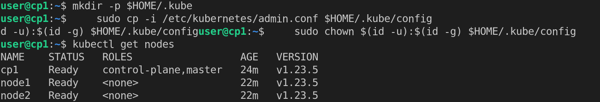
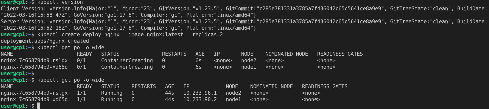

# Домашнее задание к занятию "12.4 Развертывание кластера на собственных серверах, лекция 2"
Новые проекты пошли стабильным потоком. Каждый проект требует себе несколько кластеров: под тесты и продуктив. Делать все руками — не вариант, поэтому стоит автоматизировать подготовку новых кластеров.

## Задание 1: Подготовить инвентарь kubespray
Новые тестовые кластеры требуют типичных простых настроек. Нужно подготовить инвентарь и проверить его работу. Требования к инвентарю:
* подготовка работы кластера из 5 нод: 1 мастер и 4 рабочие ноды;
* в качестве CRI — containerd;
* запуск etcd производить на мастере.

1. Склонируем репозиторий kubespray `git clone https://github.com/kubernetes-sigs/kubespray`
2. Сбилдим образ из Dockerfile в репе, запутим его и пробросим директорию с кубеспрей туда, дабы не ставить зависимости в систему
3. Скопируем `cp -rfp inventory/sample inventory/mycluster`
4. Сгенерируем hosts.yaml 
   ```bash
    declare -a IPS=(51.250.104.111 51.250.99.137 51.250.98.112)
    CONFIG_FILE=inventory/mycluster/hosts.yaml python3 contrib/inventory_builder/inventory.py ${IPS[@]} 
   ```
5. inventory по умолчанию использует containerd
6. собственно [mycluster](mycluster)
7.  `ansible-playbook -i inventory/mycluster/hosts.yaml  --become --become-user=root cluster.yml`
8.  Создадим конфиг и проверим что наш кластер поднялся и работает
      
      

## Задание 2 (*): подготовить и проверить инвентарь для кластера в AWS
Часть новых проектов хотят запускать на мощностях AWS. Требования похожи:
* разворачивать 5 нод: 1 мастер и 4 рабочие ноды;
* работать должны на минимально допустимых EC2 — t3.small.