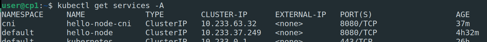
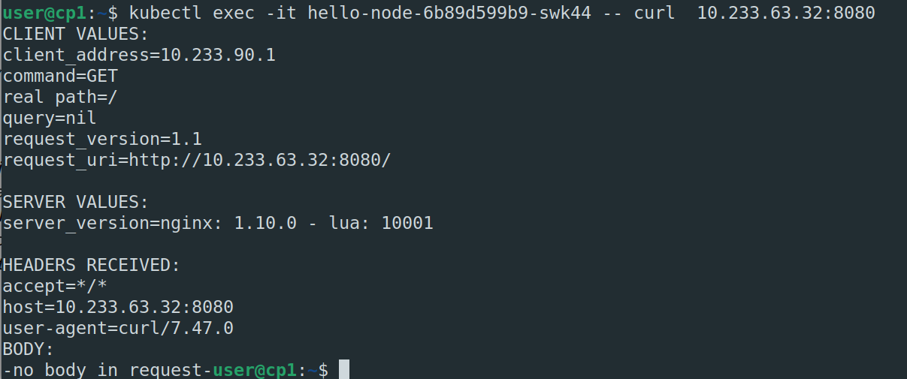
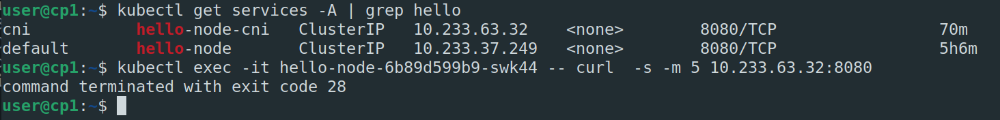
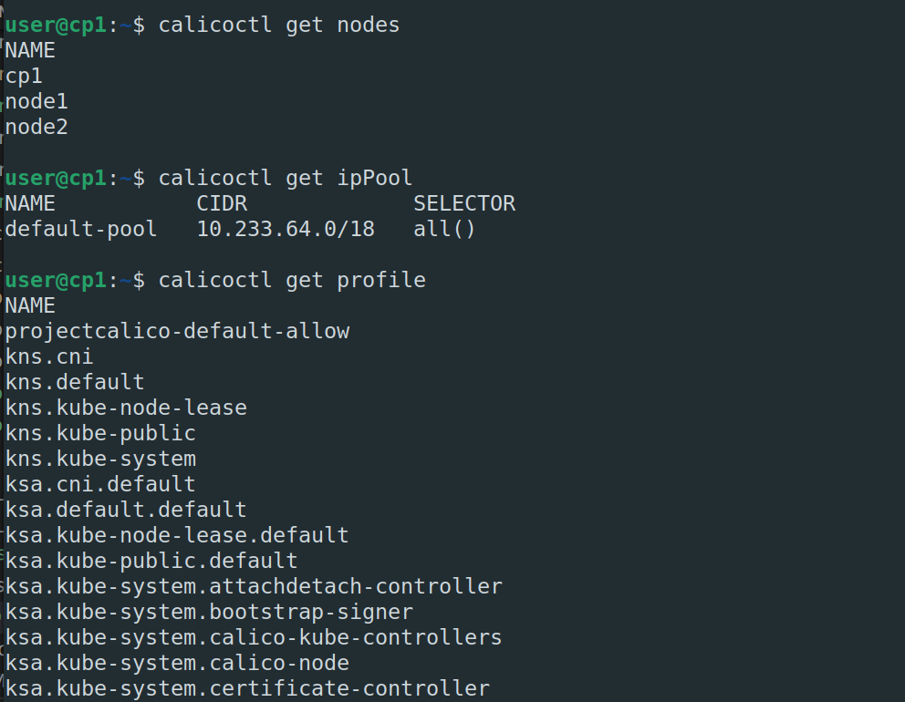

# Домашнее задание к занятию "12.5 Сетевые решения CNI"
После работы с Flannel появилась необходимость обеспечить безопасность для приложения. Для этого лучше всего подойдет Calico.
## Задание 1: установить в кластер CNI плагин Calico
Для проверки других сетевых решений стоит поставить отличный от Flannel плагин — например, Calico. Требования: 
* установка производится через ansible/kubespray;
* после применения следует настроить политику доступа к hello-world извне. Инструкции [kubernetes.io](https://kubernetes.io/docs/concepts/services-networking/network-policies/), [Calico](https://docs.projectcalico.org/about/about-network-policy)

* Поднимем кластер и создадим несколько делойментов и сервисов в разных неймспейсах.
    
* Зайдем в один из подов и попытаемся сдеать запрос в под в другом неймспейсе. Ождается что доступ будет  
    
* Добавим сетевую политику которая запрещает внешние запросы к всем подам в неймспейсе cni и повторим 
    ```yaml
        apiVersion: networking.k8s.io/v1
        kind: NetworkPolicy
        namespace: cni
        metadata:
        name: default-deny-ingress
        spec:
        podSelector: {}
        policyTypes:
            - Ingress
    ```
* Доступ запрещен, ожидаемо
      

## Задание 2: изучить, что запущено по умолчанию
Самый простой способ — проверить командой calicoctl get <type>. Для проверки стоит получить список нод, ipPool и profile.
Требования: 
* установить утилиту calicoctl;
* получить 3 вышеописанных типа в консоли.

