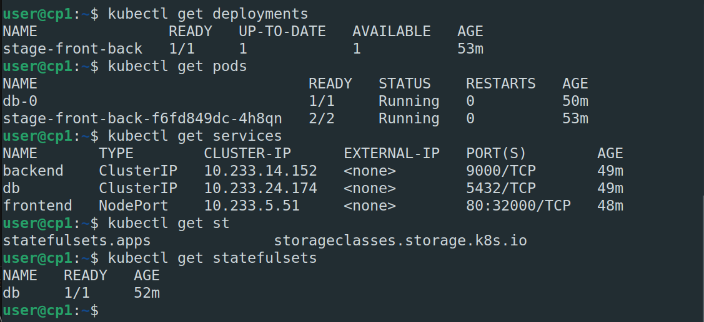

# Домашнее задание к занятию "13.1 контейнеры, поды, deployment, statefulset, services, endpoints"
Настроив кластер, подготовьте приложение к запуску в нём. Приложение стандартное: бекенд, фронтенд, база данных. Его можно найти в папке 13-kubernetes-config.

## Задание 1: подготовить тестовый конфиг для запуска приложения
Для начала следует подготовить запуск приложения в stage окружении с простыми настройками. Требования:
* под содержит в себе 2 контейнера — фронтенд, бекенд;
* регулируется с помощью deployment фронтенд и бекенд;
* база данных — через statefulset.
---
1. Создадим namespace stage ```kubectl create ns stage ```
2. Сразу установим рабочий namespace по умолчанию ```kubectl config set-context --current --namespace=stage```
3. Сбилдим образы приложений и запушим их в [dockerhub](https://hub.docker.com/) в репозиторий dzvi/netology:13-01-backend и dzvi/netology:13-01-frontend
4. Подготовим [deployment](task_1/deployment.yaml) для backend и frontend и [statefulset](task_1/db.yaml) для db.
5. Создадим [сервисы](task_1/services.yaml) для наших приложений
6. Применим файлы из папки [task_1](task_1) ```kubectl apply -f task_1/```
7. Смотрим что получилось
    
8. Смотрми все ли работает
    

## Задание 2: подготовить конфиг для production окружения
Следующим шагом будет запуск приложения в production окружении. Требования сложнее:
* каждый компонент (база, бекенд, фронтенд) запускаются в своем поде, регулируются отдельными deployment’ами;
* для связи используются service (у каждого компонента свой);
* в окружении фронта прописан адрес сервиса бекенда;
* в окружении бекенда прописан адрес сервиса базы данных.
---
1. Создадим namespace prod ```kubectl create ns prod ```
2. Создадим все ресурсы из папки [task_2](task_2)
3. Посмотрим что получилось
      
    

---
Если честно так и не понял почему на фронте ничего не появилось т.к. и в базе что-то есть и backend что-то отдает, и в сервисах ошибок никаких нет, и фронт 200 отдает. Но на фронте ничего не появилось. Хотя если через docker-compose запустить, то же самое происходит. Думаю дело не в деплое, оставлю на совести фронтенд программистов. 
    
    
    

## Задание 3 (*): добавить endpoint на внешний ресурс api
Приложению потребовалось внешнее api, и для его использования лучше добавить endpoint в кластер, направленный на это api. Требования:
* добавлен endpoint до внешнего api (например, геокодер).
  
1. Получается можно выполнить 2 способами. С помощью endpoint или создать сервис с externalName.
2. В [файле](task_3/service.yaml) Описаны  2 сервиса api-ext и api-ext-name и 1 endpoint.
3. Зайдем на какой-либо под и с него попробуем достучаться до внешнего api через наши сервисы
    