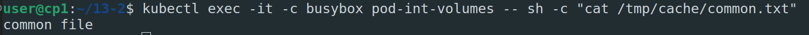
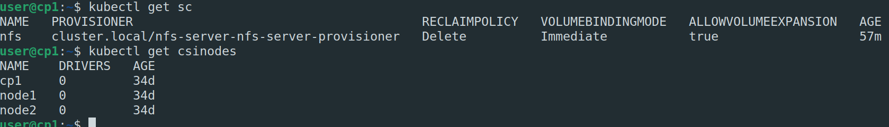
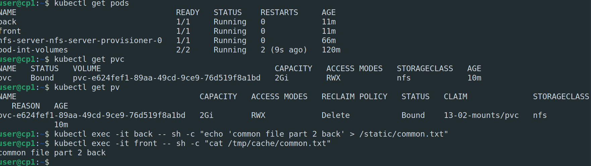

# Домашнее задание к занятию "13.2 разделы и монтирование"
Приложение запущено и работает, но время от времени появляется необходимость передавать между бекендами данные. А сам бекенд генерирует статику для фронта. Нужно оптимизировать это.
Для настройки NFS сервера можно воспользоваться следующей инструкцией (производить под пользователем на сервере, у которого есть доступ до kubectl):
* установить helm: curl https://raw.githubusercontent.com/helm/helm/master/scripts/get-helm-3 | bash
* добавить репозиторий чартов: helm repo add stable https://charts.helm.sh/stable && helm repo update
* установить nfs-server через helm: helm install nfs-server stable/nfs-server-provisioner

В конце установки будет выдан пример создания PVC для этого сервера.

## Задание 1: подключить для тестового конфига общую папку
В stage окружении часто возникает необходимость отдавать статику бекенда сразу фронтом. Проще всего сделать это через общую папку. Требования:
* в поде подключена общая папка между контейнерами (например, /static);
* после записи чего-либо в контейнере с беком файлы можно получить из контейнера с фронтом.

1. Создадим новый неймспейс `kubectl create namespace 13-02-mounts`
2. Переопределим текущие настройки контекста `kubectl create namespace 13-02-mounts`
3. 
```yaml
   apiVersion: v1
kind: Pod
metadata:
  name: pod-int-volumes
spec:
  containers:
    - name: nginx
      image: nginx
      volumeMounts:
        - mountPath: "/static"
          name: my-volume
    - name: busybox
      image: busybox
      command: ["sleep", "3600"]
      volumeMounts:
        - mountPath: "/tmp/cache"
          name: my-volume
  volumes:
    - name: my-volume
      emptyDir: {}
```
4. Создадим и запишем что-нибудь в общем томе через один из контейнеров `kubectl exec -it -c nginx pod-int-volumes -- bash -c "echo 'common file' > /static/common.txt"`
5. Проверим из другого контейнера в этом же поде что файл доступен и ему `kubectl exec -it -c busybox pod-int-volumes -- sh -c "cat /tmp/cache/common.txt`
6. 
---   

## Задание 2: подключить общую папку для прода
Поработав на stage, доработки нужно отправить на прод. В продуктиве у нас контейнеры крутятся в разных подах, поэтому потребуется PV и связь через PVC. Сам PV должен быть связан с NFS сервером. Требования:
* все бекенды подключаются к одному PV в режиме ReadWriteMany;
* фронтенды тоже подключаются к этому же PV с таким же режимом;
* файлы, созданные бекендом, должны быть доступны фронту.

1. Установим nfs как указано в мануале
    
2. Создадим поды
   ```yaml
   apiVersion: v1
    kind: Pod
    metadata:
    name: back
    spec:
    containers:
        - name: nginx
        image: nginx
        volumeMounts:
            - mountPath: "/static"
            name: my-volume
    volumes:
        - name: my-volume
        persistentVolumeClaim:
            claimName: pvc
    ---
    apiVersion: v1
    kind: Pod
    metadata:
    name: front
    spec:
    containers:
        - name: busybox
        image: busybox
        command: ["sleep", "3600"]
        volumeMounts:
            - mountPath: "/tmp/cache"
            name: my-volume
    volumes:
        - name: my-volume
        persistentVolumeClaim:
            claimName: pvc
   ```
   3. Создадим pvc
   ```yaml
   apiVersion: v1
    kind: PersistentVolumeClaim
    metadata:
    name: pvc
    spec:
    storageClassName: nfs
    accessModes:
        - ReadWriteMany
    resources:
        requests:
        storage: 2Gi
   ```
4. Проверим
    