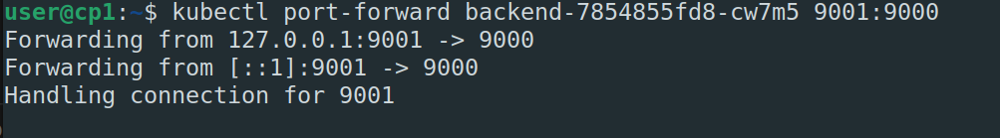
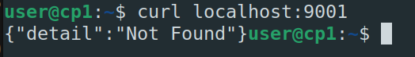
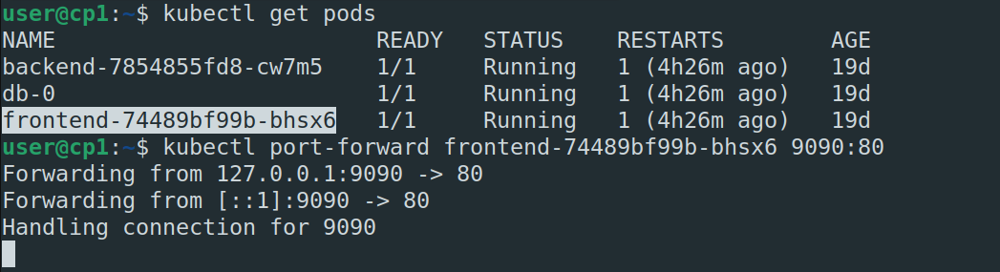
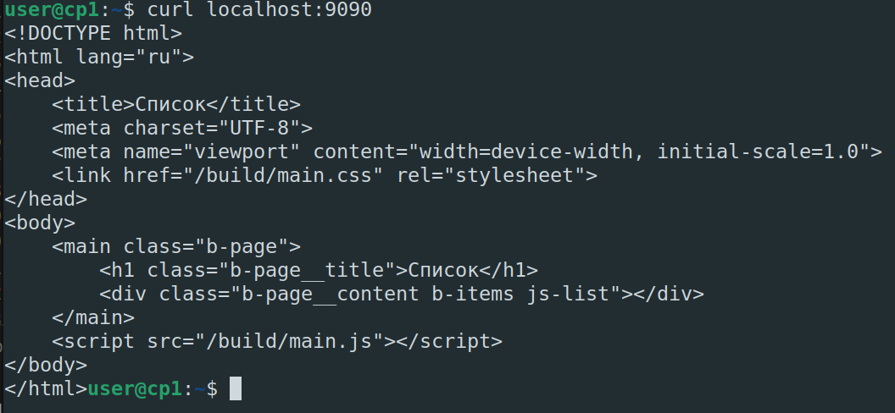
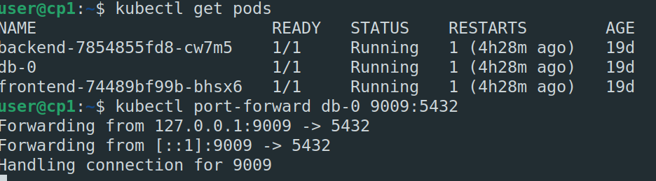
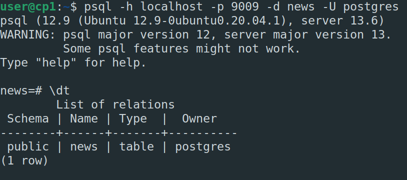
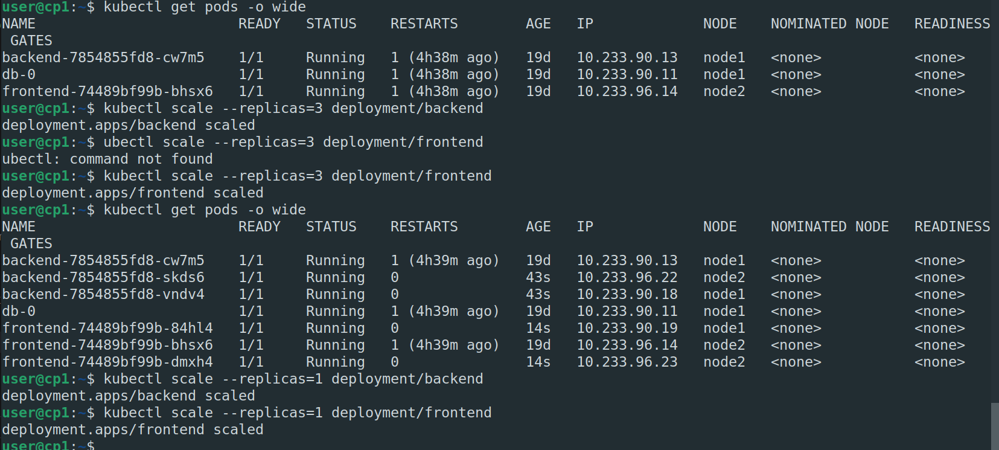

# Домашнее задание к занятию "13.3 работа с kubectl"
## Задание 1: проверить работоспособность каждого компонента
Для проверки работы можно использовать 2 способа: port-forward и exec. Используя оба способа, проверьте каждый компонент:
* сделайте запросы к бекенду;
* сделайте запросы к фронту;
* подключитесь к базе данных.

1. Запустим сервисы из задания [13.1](https://github.com/okey-stack/devops-netology/tree/main/13-kubernetes-config-01-objects)
2. Посмотрим все поды `kubectl get pods`
3. `kubectl port-forward backend-7854855fd8-cw7m5 9001:9000`
4. 
   
5. `kubectl port-forward frontend-74489bf99b-bhsx6 9090:80`
   
   
6. `kubectl port-forward db-0 9009:5432`
   
   

## Задание 2: ручное масштабирование

При работе с приложением иногда может потребоваться вручную добавить пару копий. Используя команду kubectl scale, попробуйте увеличить количество бекенда и фронта до 3. Проверьте, на каких нодах оказались копии после каждого действия (kubectl describe, kubectl get pods -o wide). После уменьшите количество копий до 1.

1. `kubectl scale --replicas=3 deployment/backend`
2. `kubectl scale --replicas=3 deployment/frontend`
3. 