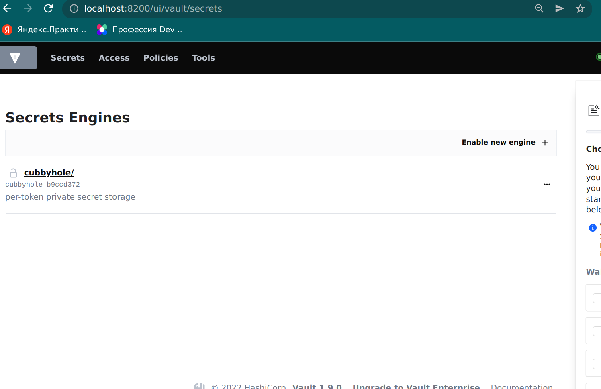
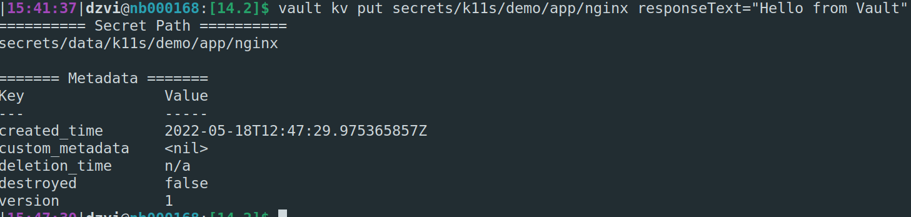
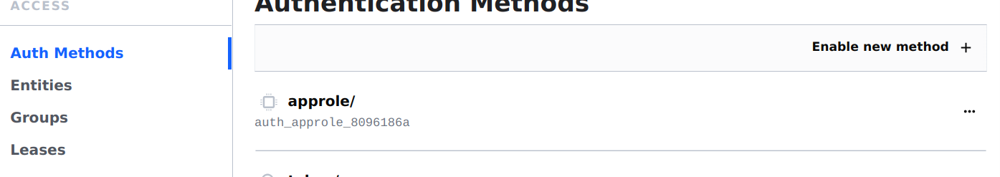
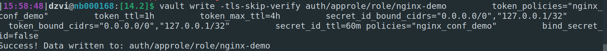
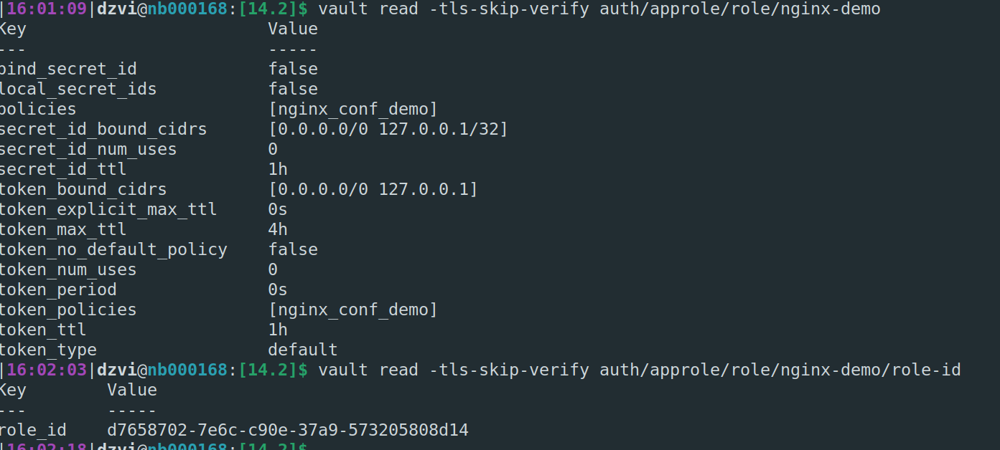
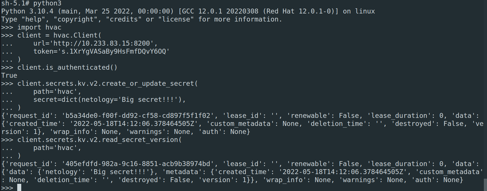
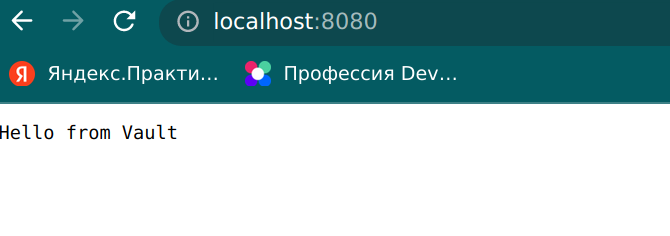
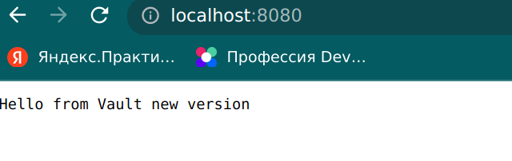
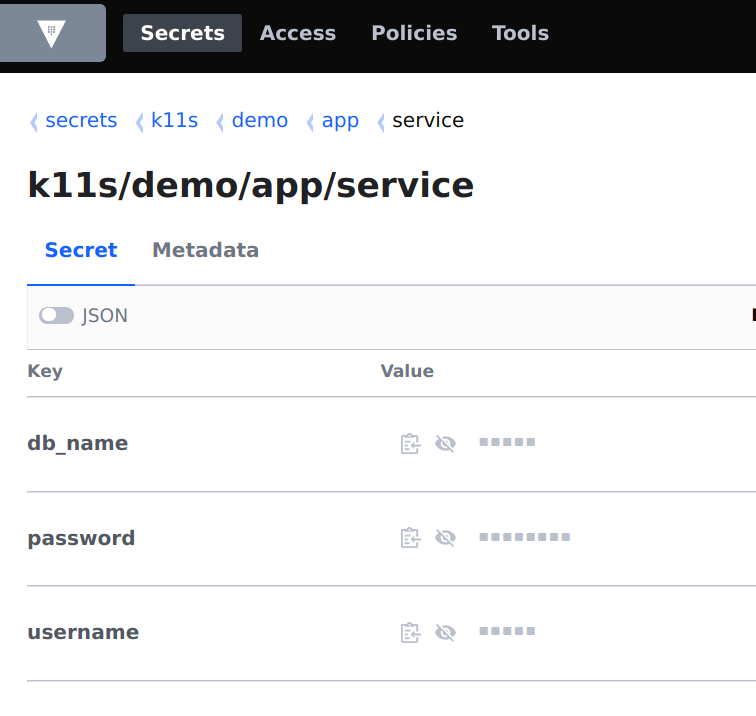
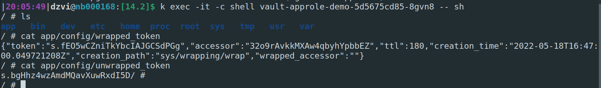

# Домашнее задание к занятию "14.2 Синхронизация секретов с внешними сервисами. Vault"

## Задача 1: Работа с модулем Vault

Запустить модуль Vault конфигураций через утилиту kubectl в установленном minikube

```
kubectl apply -f 14.2/vault-pod.yml
```

Получить значение внутреннего IP пода

```
kubectl get pod 14.2-netology-vault -o json | jq -c '.status.podIPs'
```

Примечание: jq - утилита для работы с JSON в командной строке

Запустить второй модуль для использования в качестве клиента

```
kubectl run -i --tty fedora --image=fedora --restart=Never -- sh
```

Установить дополнительные пакеты

```
dnf -y install pip
pip install hvac
```

Запустить интепретатор Python и выполнить следующий код, предварительно
поменяв IP и токен

```
import hvac
client = hvac.Client(
    url='http://10.233.83.15:8200',
    token='s.1XrYgVASaBy9HsFmfDQvY6OQ'
)
client.is_authenticated()

# Пишем секрет
client.secrets.kv.v2.create_or_update_secret(
    path='hvac',
    secret=dict(netology='Big secret!!!'),
)

# Читаем секрет
client.secrets.kv.v2.read_secret_version(
    path='hvac',
)
```
---
1. Поднимем Vault из предаставленных [манифестов](vault.yaml), немного их отредактировав
2. `k port-forward service/vault 8200:8200`
3. Зайдем на localhost:8200 и "распечаеаем" его
   
4. Установим vault клиент, настроми его и создадим секрет
    `export VAULT_ADDR=http://localhost:8200`  
    `export VAULT_TOKEN=s.1XrYgVASaBy9HsFmfDQvY6OQ`  
    `vault kv put secrets/k11s/demo/app/nginx responseText="Hello from Vault"`  
    
5. Создадим политику
   ```shell
        $ vault policy write -tls-skip-verify nginx_conf_demo -<<EOF
        # Read-only permission on secrets stored at 'secrets/k11s/demo/app/nginx'
        path "secrets/data/k11s/demo/app/nginx" {
        capabilities = [ "read" ]
        }
        EOF

    ```

    
6. Включим approle и создадим роль
      

    ```shell
        $ vault write -tls-skip-verify auth/approle/role/nginx-demo \
        token_policies="nginx_conf_demo" \
        token_ttl=1h \
        token_max_ttl=4h \
        secret_id_bound_cidrs="0.0.0.0/0","127.0.0.1/32" \
        token_bound_cidrs="0.0.0.0/0","127.0.0.1/32" \
        secret_id_ttl=60m policies="nginx_conf_demo" \
        bind_secret_id=false

    ```
     
7. Проверим 
    `vault read -tls-skip-verify auth/approle/role/nginx-demo`  
    `vault read -tls-skip-verify auth/approle/role/nginx-demo/role-id`  
    

8. Подкорректируем настройки для подключения посмотрев ip poda и token в gui vault
    ```python
        client = hvac.Client(
        url='http://10.233.83.15:8200', 
        token='s.1XrYgVASaBy9HsFmfDQvY6OQ'
        )
    ```
9. Выполним код
    

## Задача 2 (*): Работа с секретами внутри модуля

* На основе образа fedora создать модуль;
* Создать секрет, в котором будет указан токен;
* Подключить секрет к модулю;
* Запустить модуль и проверить доступность сервиса Vault.
  
---
# Nginx
1. Из репозитория возьмем [манифесты](nginx.yaml) для cm и pod nginx
2. Пробросим порт пода с nginx и посмотрим результат
      
3. обновим секрет и пороверим обновление конфига nginx
    
# App
1. Создадим секреты для app
    `vault kv put secrets/k11s/demo/app/service db_name="users" username="admin" password="passw0rd"`
    
2. Применим [манифесты](app.yaml)
3. Создадим политику
    ```shell
    vault policy write -tls-skip-verify app_policy_name -<<EOF
    # Read-only permission on secrets stored at 'secrets/k11s/demo/app/service'
    path "secrets/data/k11s/demo/app/service" {
    capabilities = [ "read" ]
    }
    EOF

    ```
4. Создадим роль
    ```shell
    vault write -tls-skip-verify auth/approle/role/my-app-role \
    token_policies="app_policy_name" \
    token_ttl=1h \
    token_max_ttl=4h \
    secret_id_bound_cidrs="0.0.0.0/0","127.0.0.1/32" \
    token_bound_cidrs="0.0.0.0/0","127.0.0.1/32" \
    secret_id_ttl=60m policies="app_policy_name" \
    bind_secret_id=false

    ```
5. Зайдем в контейнер shell
    `k exec -it -c shell vault-approle-demo-5d5675cd85-8gvn8 -- sh`
    