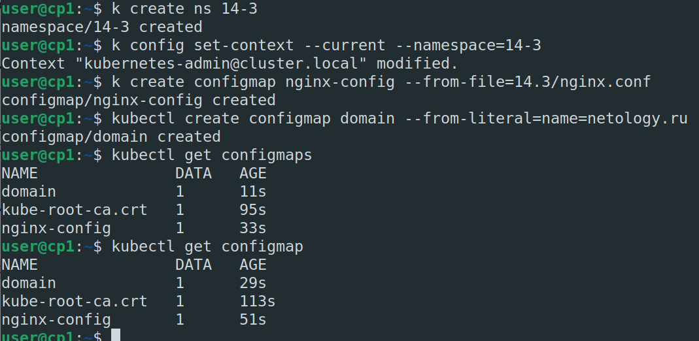
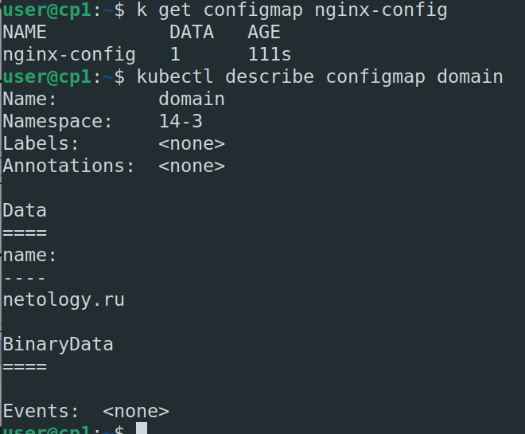
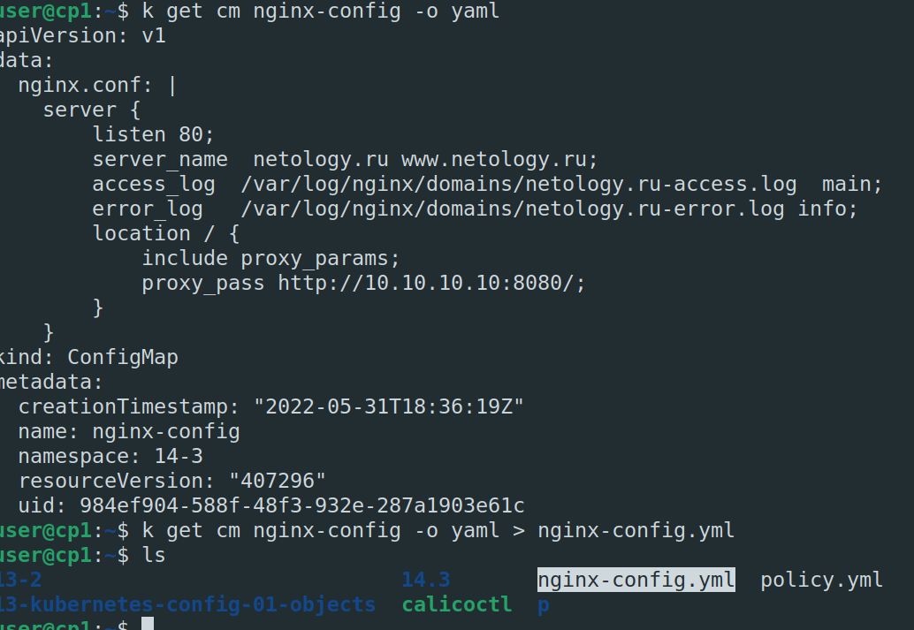
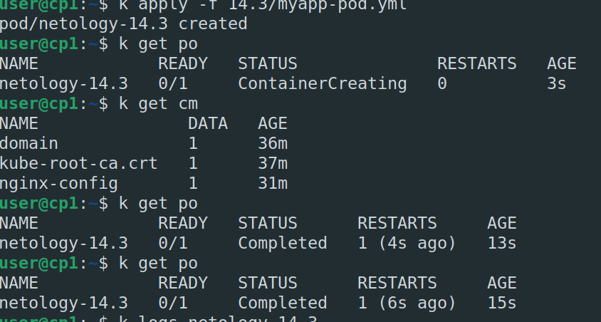
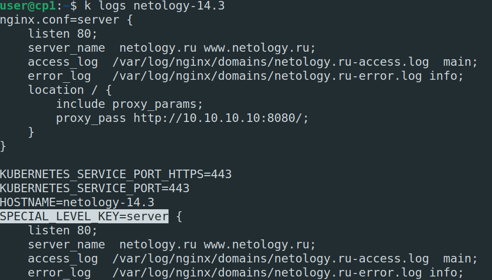

# Домашнее задание к занятию "14.3 Карты конфигураций"

## Задача 1: Работа с картами конфигураций через утилиту kubectl в установленном minikube

Выполните приведённые команды в консоли. Получите вывод команд. Сохраните
задачу 1 как справочный материал.

### Как создать карту конфигураций?

```
kubectl create configmap nginx-config --from-file=nginx.conf
kubectl create configmap domain --from-literal=name=netology.ru
```

### Как просмотреть список карт конфигураций?

```
kubectl get configmaps
kubectl get configmap
```

### Как просмотреть карту конфигурации?

```
kubectl get configmap nginx-config
kubectl describe configmap domain
```

### Как получить информацию в формате YAML и/или JSON?

```
kubectl get configmap nginx-config -o yaml
kubectl get configmap domain -o json
```

### Как выгрузить карту конфигурации и сохранить его в файл?

```
kubectl get configmaps -o json > configmaps.json
kubectl get configmap nginx-config -o yaml > nginx-config.yml
```

### Как удалить карту конфигурации?

```
kubectl delete configmap nginx-config
```

### Как загрузить карту конфигурации из файла?

```
kubectl apply -f nginx-config.yml
```
---





## Задача 2 (*): Работа с картами конфигураций внутри модуля

Выбрать любимый образ контейнера, подключить карты конфигураций и проверить
их доступность как в виде переменных окружения, так и в виде примонтированного
тома
---
Создадим под из [файла](14.3/myapp-pod.yml)  
  
Посмотрим логи пода. Ддолжны увидеть следущие переменные окружения - SPECIAL_LEVEL_KEY, все переменные заданные в configmape   (там только nginx.conf), и файл nginx.conf в дирректории /etc/nginx/conf.d  
  
  